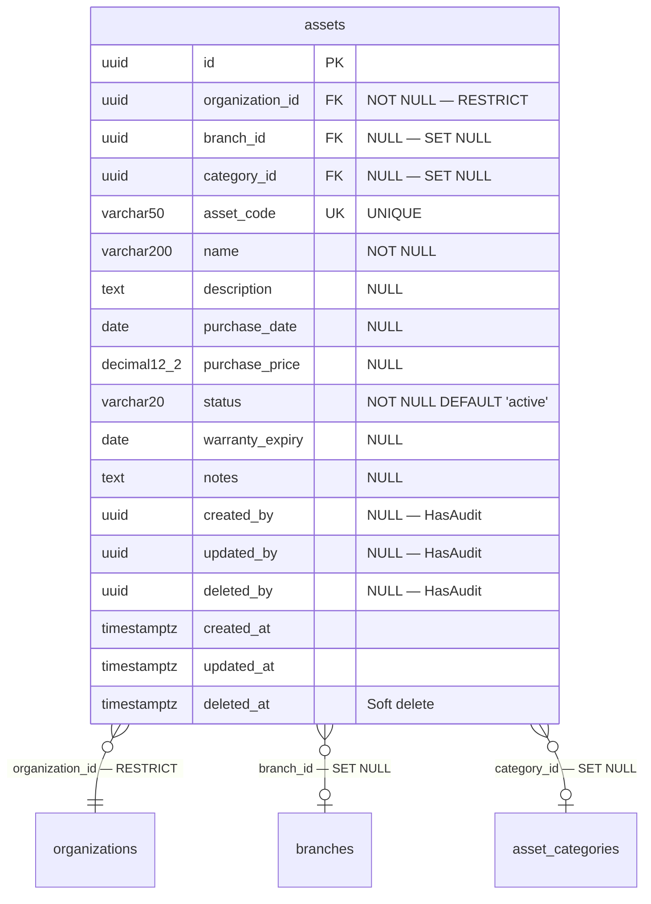

# Phase 22 — Asset ERD

**Date:** 2026-08-17 | **Phase:** 22 — Asset | **Status:** STEP_22_04_DRAFT

## 1. Entity — `assets`



## 2. Entity Specification

| # | Column | Type | Nullable | Default | Key | FK |
|---|---|---|---|---|---|---|
| 1 | `id` | `uuid` | NOT NULL | — | PK | — |
| 2 | `organization_id` | `uuid` | NOT NULL | — | — | → organizations.id RESTRICT |
| 3 | `branch_id` | `uuid` | NULL | — | — | → branches.id SET NULL |
| 4 | `category_id` | `uuid` | NULL | — | — | → asset_categories.id SET NULL |
| 5 | `asset_code` | `varchar(50)` | NOT NULL | — | UK | — |
| 6 | `name` | `varchar(200)` | NOT NULL | — | — | — |
| 7 | `description` | `text` | NULL | — | — | — |
| 8 | `purchase_date` | `date` | NULL | — | — | — |
| 9 | `purchase_price` | `decimal(12,2)` | NULL | — | — | — |
| 10 | `status` | `varchar(20)` | NOT NULL | `active` | — | — |
| 11 | `warranty_expiry` | `date` | NULL | — | — | — |
| 12 | `notes` | `text` | NULL | — | — | — |
| 13 | `created_by` | `uuid` | NULL | — | — | — |
| 14 | `updated_by` | `uuid` | NULL | — | — | — |
| 15 | `deleted_by` | `uuid` | NULL | — | — | — |
| 16 | `created_at` | `timestamptz` | NOT NULL | CURRENT_TIMESTAMP | — | — |
| 17 | `updated_at` | `timestamptz` | NULL | — | — | — |
| 18 | `deleted_at` | `timestamptz` | NULL | — | — | — |

**18 columns.**

## 3. Relationship Inventory

| # | Child | FK | Parent | Cardinality | ON DELETE | Optional? |
|---|---|---|---|---|---|---|
| 1 | `assets` | `organization_id` | `organizations` | N:1 | RESTRICT | No |
| 2 | `assets` | `branch_id` | `branches` | N:1 | SET NULL | Yes |
| 3 | `assets` | `category_id` | `asset_categories` | N:1 | SET NULL | Yes |

**3 relationships. 0 CASCADE.**

## 4. Constraint & Index Inventory

| Entity | Constraint/Index | Columns | Type |
|---|---|---|---|
| `assets` | PK | `(id)` | PRIMARY KEY |
| `assets` | `assets_asset_code_unique` | `(asset_code)` | UNIQUE |
| `assets` | `assets_org_status_idx` | `(organization_id, status)` | Composite B-tree |
| `assets` | `assets_category_id_idx` | `(category_id)` | B-tree |

**4 indexes (1 PK + 1 UK + 2 composite/single).**

## 5. Model Guidance

```php
use App\Core\Base\BaseModel;

class Asset extends BaseModel
{
    protected $table = 'assets';

    protected $casts = [
        'purchase_date'   => 'date',
        'purchase_price'  => 'decimal:2',
        'warranty_expiry' => 'date',
        'created_at'      => 'datetime',
        'updated_at'      => 'datetime',
        'deleted_at'      => 'datetime',
    ];
}
```

- Extends `BaseModel` (HasUuid, HasAudit, SoftDeletes, $guarded=[])