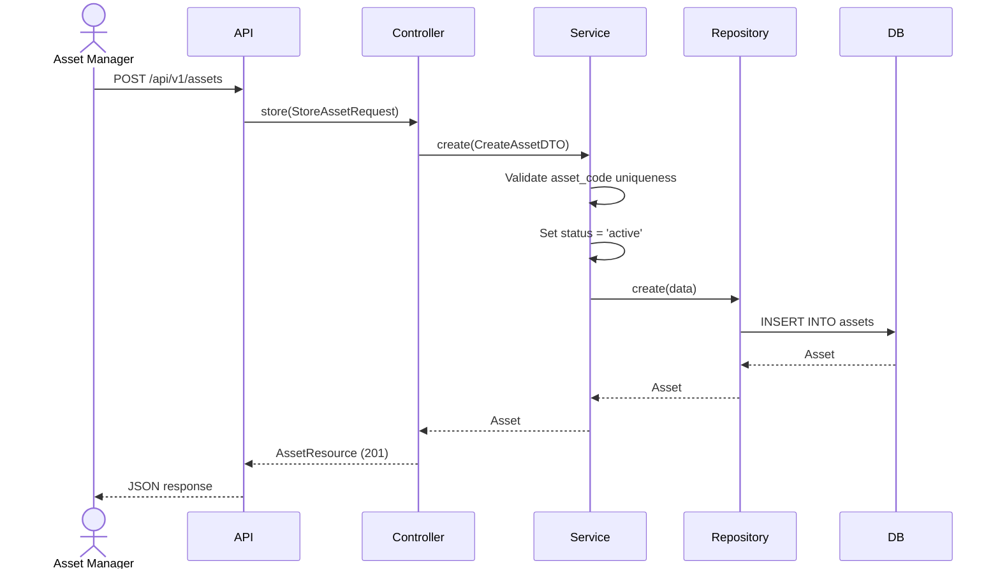
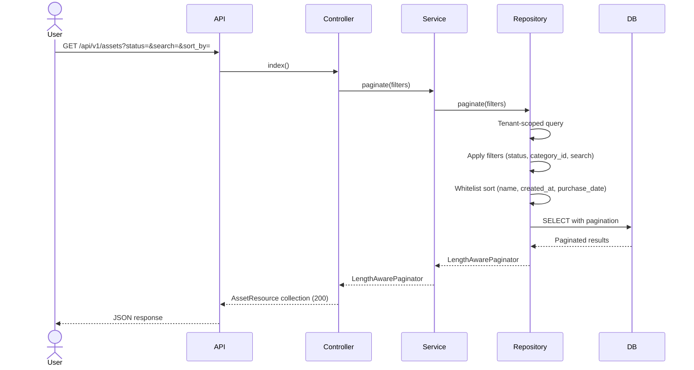
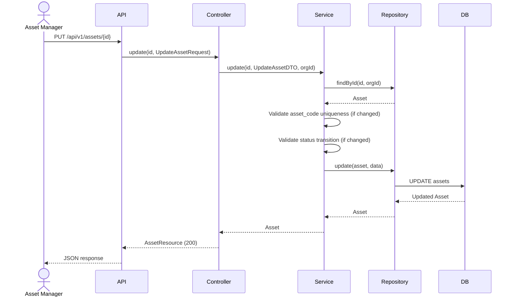
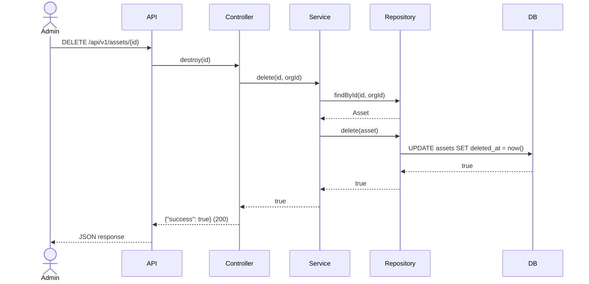

# Phase 22 — Asset Flow

**Date:** 2026-08-17 | **Phase:** 22 — Asset | **Status:** STEP_22_03_DRAFT

## Flows

### 1. Create Asset

### 2. List Assets

### 3. Update Asset

### 4. Delete Asset

### Traceability

| Flow | Requirement | Business Rule |
|---|---|---|
| Create | ASST-REQ-001, ASST-REQ-002, ASST-REQ-005, ASST-REQ-006, ASST-REQ-017 | BR-ASST-001, BR-ASST-004, BR-ASST-005, BR-ASST-006, BR-ASST-015 |
| List | ASST-REQ-013, ASST-REQ-014, ASST-REQ-015, ASST-REQ-016 | BR-ASST-008, BR-ASST-009 |
| Update | ASST-REQ-018 | BR-ASST-004, BR-ASST-016, BR-ASST-017 |
| Delete | ASST-REQ-019 | BR-ASST-010 |