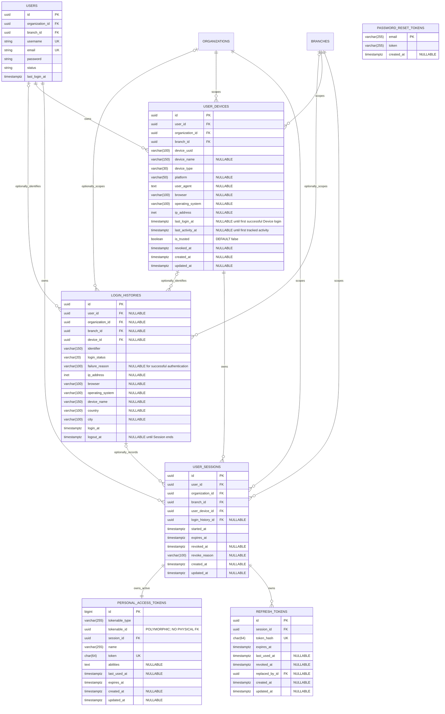

# Authentication ERD

## Governance

This ERD follows Accepted `DD-AUTH-007`, Accepted `ADR-005`, Accepted `DD-AUTH-017`, and Accepted `DD-AUTH-018`. DD-AUTH-017 is the active field classification, exposure, nullability, and field-governance authority; DD-AUTH-018 is the credential-change projection-precedence authority; DD-AUTH-005 remains superseded historical evidence.

| Entity | Primary Data Category |
|---|---|
| `LOGIN_HISTORIES` | Operational History Projection |
| `USER_DEVICES` | Mutable Operational State |
| `USER_SESSIONS` | Mutable Operational State |
| `PERSONAL_ACCESS_TOKENS`, `REFRESH_TOKENS` | Revocable Security Data |
| Framework-managed password reset records | Expiring Security Data |

Canonical Authentication Audit Events are Immutable Audit Events in the Audit Platform and are intentionally outside this operational ERD.

## Root Relationship

```text
Authentication
├── users
│   ├── login_histories
│   └── user_devices
│       └── user_sessions
│           ├── personal_access_tokens
│           └── refresh_tokens
└── password_reset_tokens (Framework Managed)

organizations
├──< user_devices
├──< login_histories
└──< user_sessions

branches
├──< user_devices
├──< login_histories
└──< user_sessions
```

## Mermaid ERD



## Framework-Managed Password Reset

```text
password_reset_tokens

Framework Managed
Laravel Password Broker
email PK
token hash
created_at NULLABLE
```

The table is managed by Laravel's `Illuminate\Auth\Passwords\DatabaseTokenRepository`. It is included as a framework-managed persistent entity for field, nullability, and lifecycle alignment; Authentication defines no custom migration for it. Expiry is derived from `created_at` and configured TTL.

## Relationship Rules

### User

- One User owns many Device Sessions.
- One User may have many Sanctum Access Tokens.
- One User may have many Refresh Tokens across devices.
- One User has Login History Operational History Projection records with only the approved controlled `logout_at` mutation.

### Device

- A Device belongs to one User, Organization, and Branch context.
- A Device is uniquely identified by `(user_id, device_uuid)`.
- `last_login_at` records the latest successful login on the Device.
- `last_activity_at` records the latest authenticated activity on the Device.
- `is_trusted` is persisted and can be revoked independently of activity state.
- API field `is_active` is derived from `revoked_at IS NULL`; it is not stored separately.
- Revoking a Device revokes every Access Token and Refresh Token associated with it.
- Current-device revocation is performed through the logout flow.

### Session

- `user_sessions` is the Authentication session boundary.
- A Session belongs to one User, Organization, Branch, and Device.
- One Device can own multiple Sessions while preserving an independent Device lifecycle.
- `login_history_id` is nullable and uses `SET NULL`.
- Every active Session owns exactly one active Sanctum Access Token.
- Every active Session owns exactly one active Refresh Token family.
- A Refresh Token family can contain multiple historical revoked/replaced token rows, but only one token can be active.
- Logout revokes only the current Session and its descendant tokens.
- Logout All revokes every active Session owned by the User.
- Device Revocation marks the Device revoked and revokes every Session under it.

### Token

- Access Tokens are managed by Laravel Sanctum.
- Every Authentication-issued Access Token and Refresh Token belongs to one Session through `session_id`.
- Access Token expiry is 60 minutes.
- Refresh Tokens are valid for 30 days, single-use, opaque, and stored as SHA-256 hashes.
- Every refresh rotates the Refresh Token and links the replacement through `replaced_by_id`.
- Reuse of a rotated Refresh Token revokes its entire token family, owning Session, and descendant Access Token under Accepted DD-AUTH-007.
- Password Reset Tokens are managed by Laravel Password Broker, valid for 15 minutes through configuration, single-use, and hashed at rest.

### Login History

- Login History is an Operational History Projection. Fields are immutable after creation except `logout_at`, which uses `Controlled One-Time Mutation` under Accepted DD-AUTH-017; lifecycle authority remains Accepted DD-AUTH-007.
- Accepted DD-AUTH-018 makes credential-change revocation an explicit exception: it does not invoke the `logout_at` mutation.
- Canonical Audit Events are separate, append-only, and immutable.
- It records successful login, failed login, and logout session outcomes.
- `login_at` records the authentication attempt timestamp and is required for both successful and failed attempts; `logout_at` is nullable.
- It retains login/logout time, IP address, browser, operating system, device name, country and city when available, login status, and generic failure reason.
- Users can query only their own history within the active tenant context.

## Foreign Keys

| Child Table | Column | Parent | Delete Rule |
|---|---|---|---|
| `user_devices` | `user_id` | `users.id` | RESTRICT |
| `user_devices` | `organization_id` | `organizations.id` | RESTRICT |
| `user_devices` | `branch_id` | `branches.id` | RESTRICT |
| `user_sessions` | `user_id` | `users.id` | RESTRICT |
| `user_sessions` | `organization_id` | `organizations.id` | RESTRICT |
| `user_sessions` | `branch_id` | `branches.id` | RESTRICT |
| `user_sessions` | `user_device_id` | `user_devices.id` | RESTRICT |
| `user_sessions` | `login_history_id` | `login_histories.id` | SET NULL |
| `refresh_tokens` | `session_id` | `user_sessions.id` | RESTRICT |
| `refresh_tokens` | `replaced_by_id` | `refresh_tokens.id` | SET NULL |
| `login_histories` | `user_id` | `users.id` | SET NULL |
| `login_histories` | `organization_id` | `organizations.id` | RESTRICT |
| `login_histories` | `branch_id` | `branches.id` | RESTRICT |
| `login_histories` | `device_id` | `user_devices.id` | SET NULL |
| `personal_access_tokens` | `session_id` | `user_sessions.id` | CASCADE through Session lifecycle |

`personal_access_tokens.tokenable_type` and `tokenable_id` are polymorphic and have no physical foreign key. Required `session_id` and the ownership invariant ensure that `tokenable_id` matches the Session owner.

## Index Strategy

- `user_devices`: `(user_id)`.
- `user_devices`: `(organization_id)`.
- `user_devices`: `(branch_id)`.
- `user_devices`: `(device_type)`.
- `user_devices`: `(last_login_at)`.
- `user_devices`: `(last_activity_at)`.
- `user_devices`: `(is_trusted)`.
- `user_devices`: `(revoked_at)`.
- `user_devices`: unique `(user_id, device_uuid)`.
- `user_devices`: `(user_id, revoked_at, last_activity_at)`.
- `user_sessions`: `(user_id)`.
- `user_sessions`: `(organization_id)`.
- `user_sessions`: `(branch_id)`.
- `user_sessions`: `(user_device_id)`.
- `user_sessions`: `(login_history_id)`.
- `user_sessions`: `(started_at)`.
- `user_sessions`: `(expires_at)`.
- `user_sessions`: `(revoked_at)`.
- `user_sessions`: `(user_device_id, revoked_at)`.
- `user_sessions`: `(user_id, revoked_at)`.
- `user_sessions`: `(organization_id, branch_id, user_id, revoked_at)`.
- `refresh_tokens`: unique `token_hash`.
- `refresh_tokens`: `(session_id)`.
- `refresh_tokens`: `(expires_at)`.
- `refresh_tokens`: `(revoked_at)`.
- `personal_access_tokens`: unique `(session_id)`.
- `personal_access_tokens`: unique `(token)`.
- `personal_access_tokens`: `(tokenable_type, tokenable_id)`.
- `personal_access_tokens`: `(expires_at)`.
- `login_histories`: `(user_id)`.
- `login_histories`: `(organization_id)`.
- `login_histories`: `(branch_id)`.
- `login_histories`: `(device_id)`.
- `login_histories`: `(identifier)`.
- `login_histories`: `(login_status)`.
- `login_histories`: `(ip_address)`.
- `login_histories`: `(login_at)`.
- `login_histories`: `(logout_at)`.
- `login_histories`: `(user_id, login_at DESC, id DESC)`.
- `login_histories`: `(organization_id, branch_id, login_at DESC, id DESC)`.
- `login_histories`: `(identifier, login_status, login_at DESC, id DESC)`.

Accepted DD-AUTH-010 requires `id DESC` as the deterministic tie-breaker. Partial indexes remain excluded until approved query/load evidence exists.

## Active Token Constraints

- `personal_access_tokens`: `UNIQUE (session_id)` enforces one Sanctum Access Token row per Session.
- `refresh_tokens`: partial unique `UNIQUE (session_id) WHERE revoked_at IS NULL` enforces one active Refresh Token per Session while preserving historical token-family rows.
- Revoked or expired Sessions cannot own active Access or Refresh Tokens.

## Revocation Boundary

| Action | Device | Session | Access Token | Refresh Token |
|---|---|---|---|---|
| Logout | Remains registered | Revoke current Session | Revoke current Session token | Revoke current Session active family |
| Logout All | Remains registered | Revoke all User Sessions | Revoke all User tokens | Revoke all User token families |
| Revoke Device | Set `revoked_at` | Revoke every Device Session | Revoke all descendant tokens | Revoke all descendant token families |

Revocation never deletes Login History or Audit Events. Login History retains its approved projection lifecycle; canonical Audit Events remain append-only and immutable.

## Lifecycle and Cleanup Boundary

- Device records use approved `Mutable Operational State` and `Revocable` lifecycle transitions. Session records use approved `Mutable Operational State`, `Revocable`, and `Expiring` lifecycle transitions. Neither is an ordinary Business Record.
- Security token records use revocation/expiry before any authorized `Hard Deletable` cleanup.
- Archive and cleanup are asynchronous background lifecycle operations and never block normal Authentication transactions.
- Cleanup requires retention eligibility, Legal Hold evaluation, authorization, immutable evidence, and referential preservation.
- Secret values/hashes are never archived, audited, or represented in this ERD as public data.

## Data Ownership

Authentication owns:

- `login_histories`
- `user_devices`
- `user_sessions`
- `refresh_tokens`
- Authentication use of `personal_access_tokens`

Authentication does not own or duplicate:

- `users`
- `organizations`
- `branches`
- Roles and permissions
- `password_reset_tokens` schema (Laravel framework managed)
