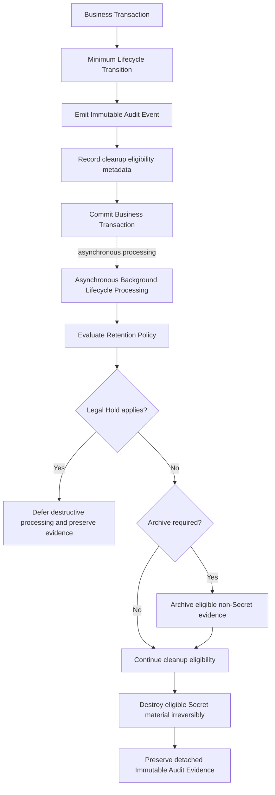
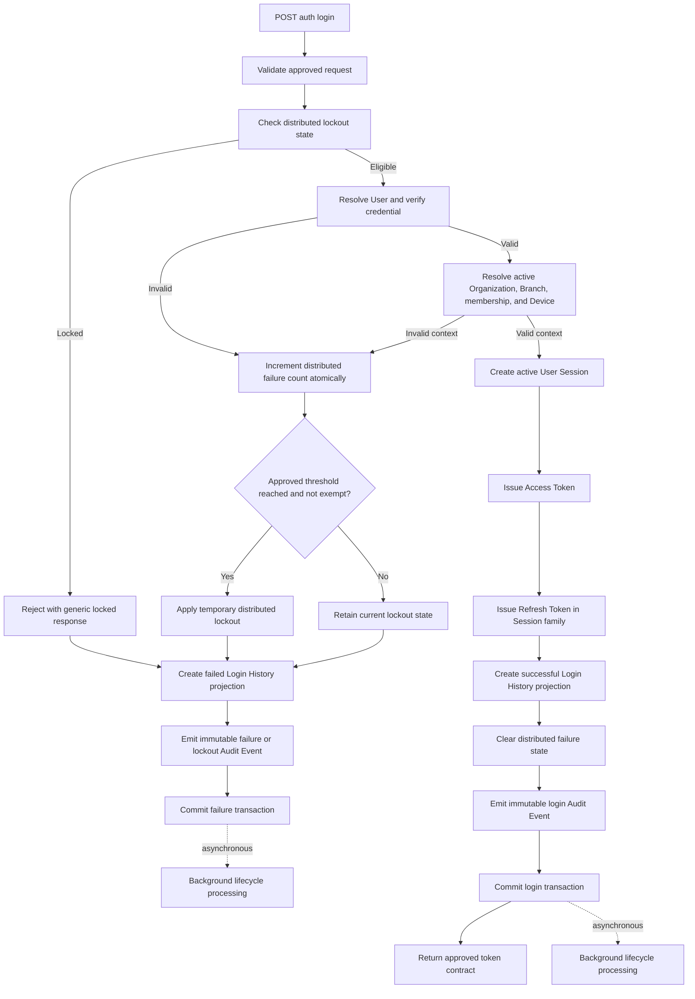
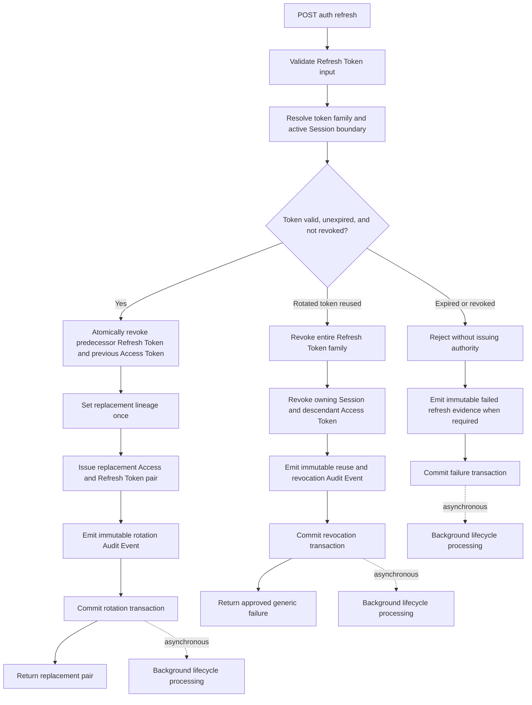
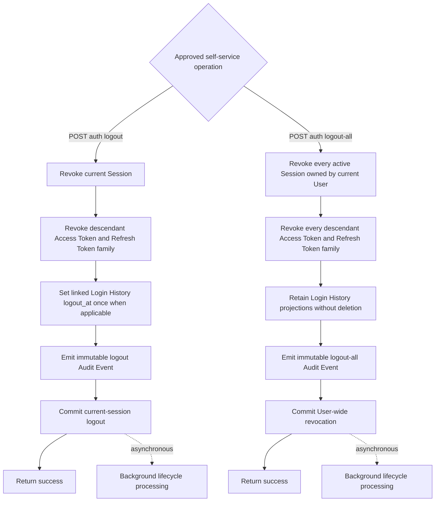
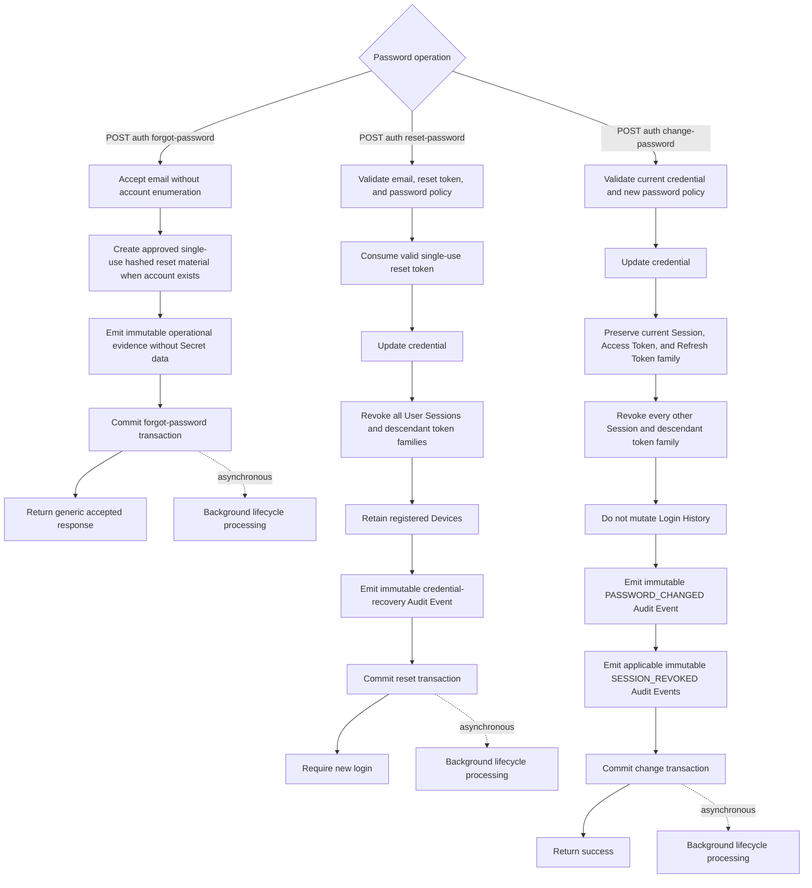
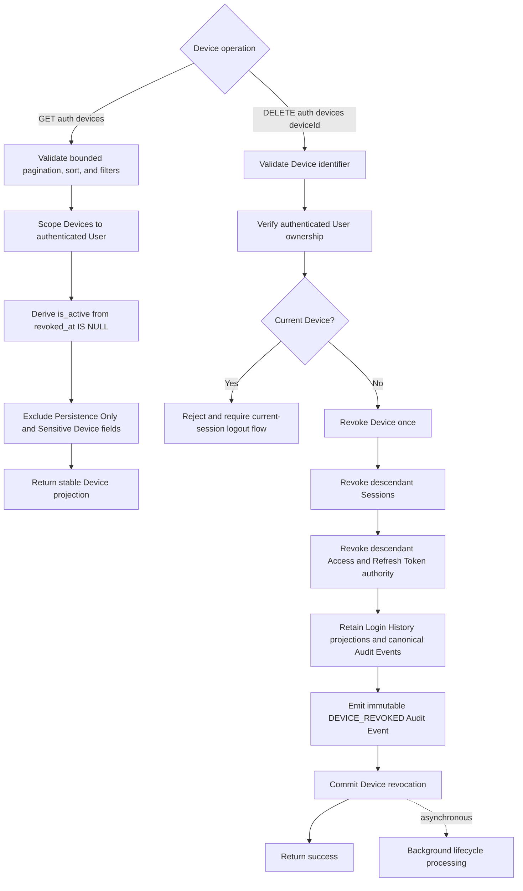
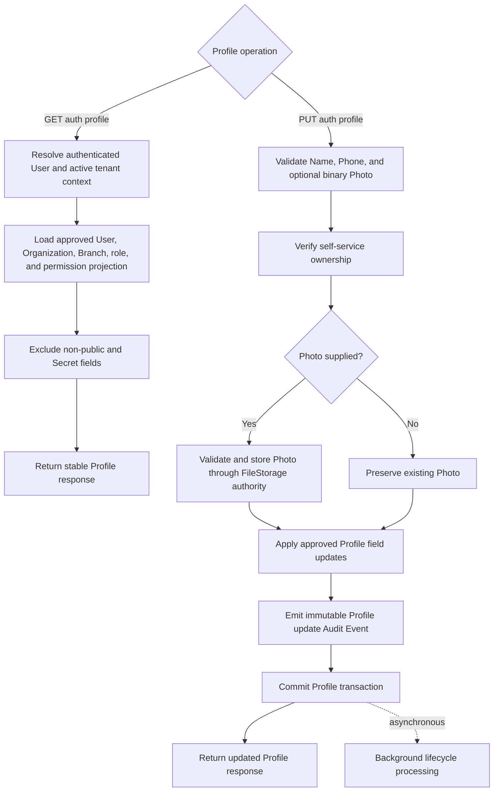
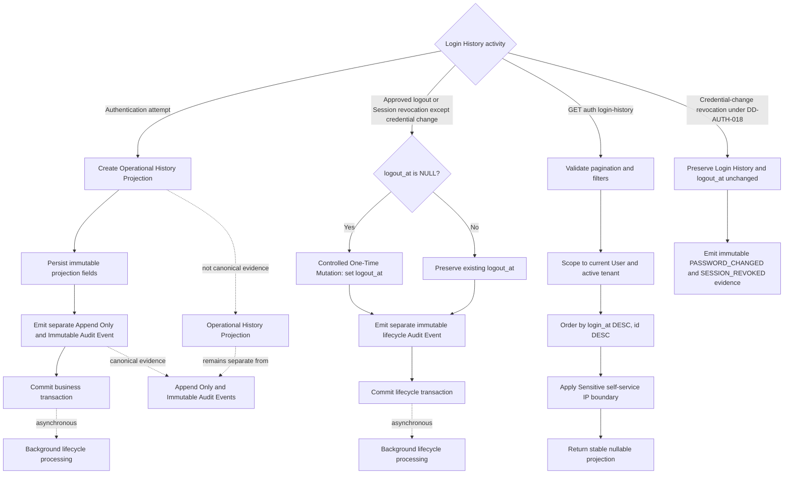
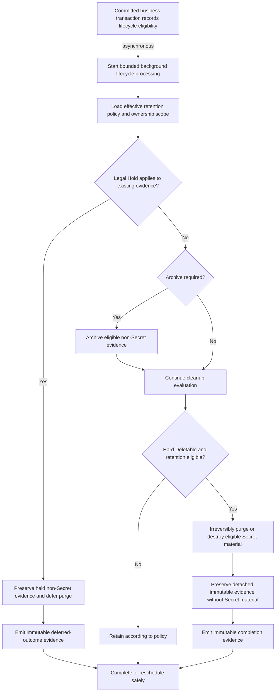

# Authentication Flowcharts

This derived artifact visualizes the Accepted Authentication architecture. It introduces no endpoint, business rule, lifecycle transition, security policy, or governance decision.

Authorities:

- `DD-AUTH-003` for the self-service Session and Device boundary.
- `DD-AUTH-007` and `ADR-005` for lifecycle, audit, retention, archive, Legal Hold, cleanup, and Secret destruction.
- `DD-AUTH-010` for deterministic Login History ordering.
- `DD-AUTH-017` for field classification, exposure, nullability, and field governance; it supersedes DD-AUTH-005.
- `DD-AUTH-018` for the credential-change projection exception.
- `ADR-006` for canonical Audit Event and Login History projection authority; it supersedes ADR-004.
- `API.md`, OpenAPI, `Flow.md`, and `SequenceDiagram.md` for the existing Authentication contract and flow.

Login History is an Operational History Projection. It is never canonical Audit Evidence. Canonical Audit Events remain separate, `Append Only`, and `Immutable`.

## Shared Lifecycle Boundary

Every state-changing flow below uses this boundary:

Background retention, archive, cleanup, purge, Secret destruction, and Legal Hold evaluation are asynchronous, idempotent, retry-safe, resumable, and bounded. Normal business transactions do not wait for them.

## Login, Failure, And Lockout

## Refresh Rotation And Reuse Detection

## Logout Current And Logout All

## Password Flows

## Device Listing And Revocation

All Device operations are self-service, including for Super Admin. Cross-user administration is outside Authentication under DD-AUTH-003.

## Profile Retrieval And Update

## Login History Projection And Audit Separation

## Background Retention, Archive, Cleanup, And Destruction

Legal Hold preserves existing evidence; it never restores destroyed Secret material. Canonical Audit Events remain authoritative and are never replaced by Login History projections or archive-derived operational copies.
