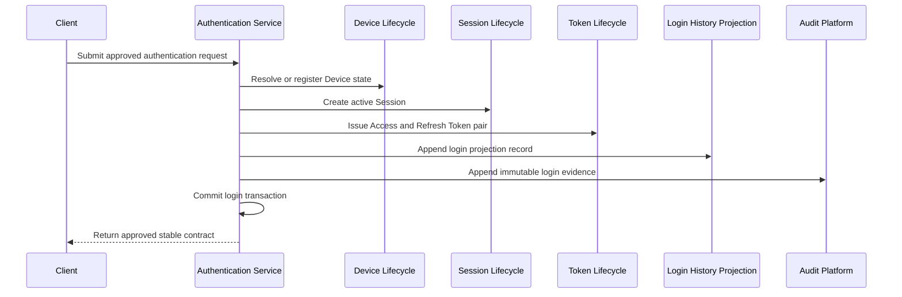
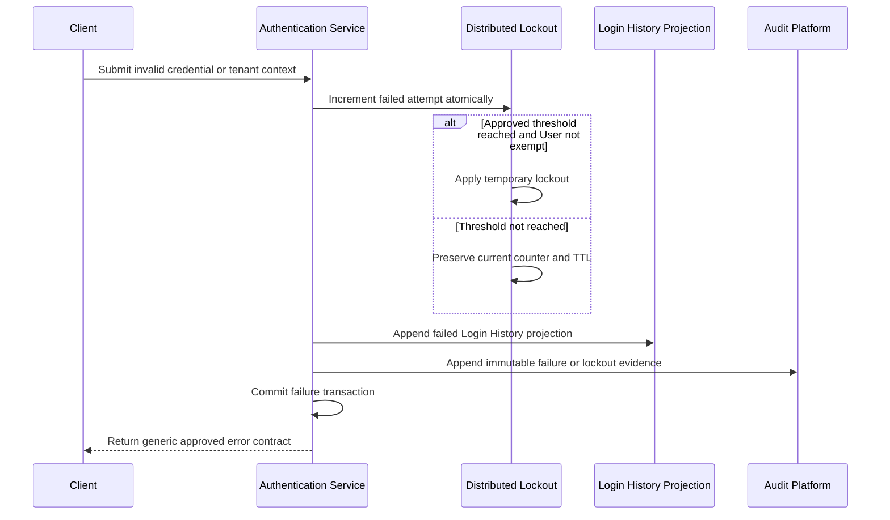
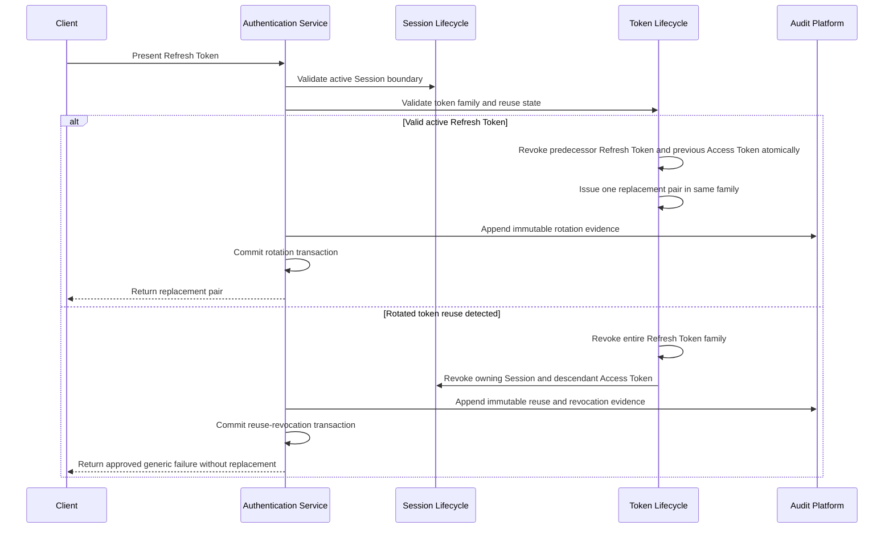
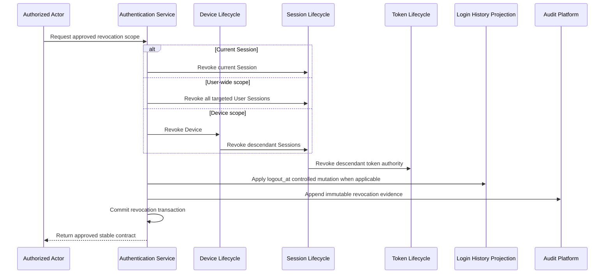
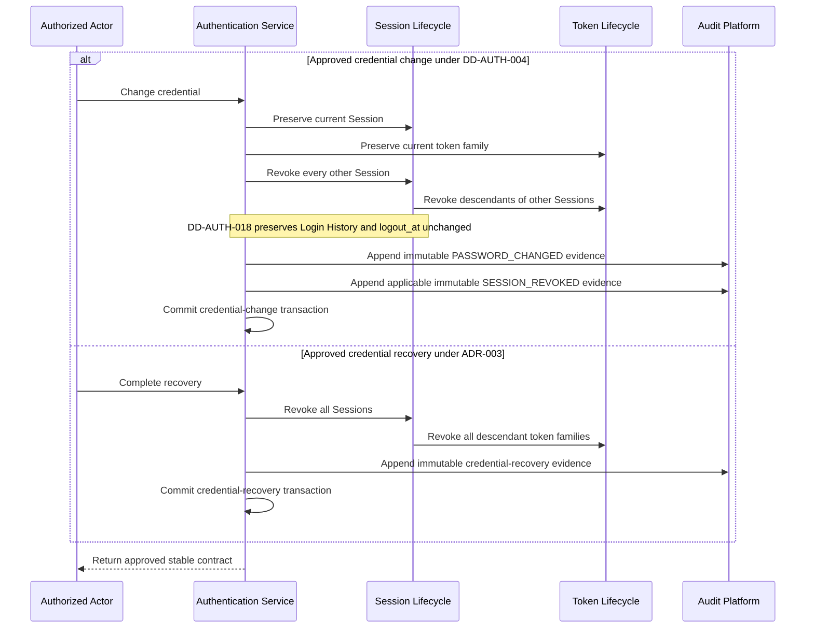
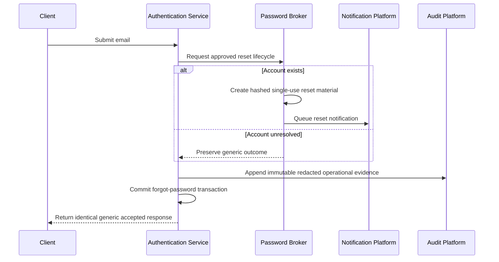
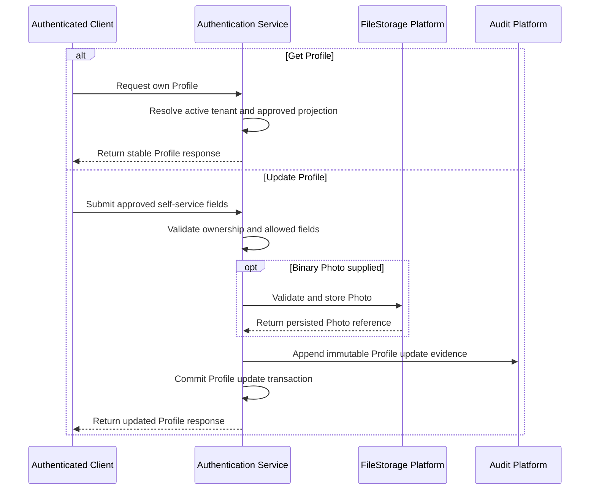
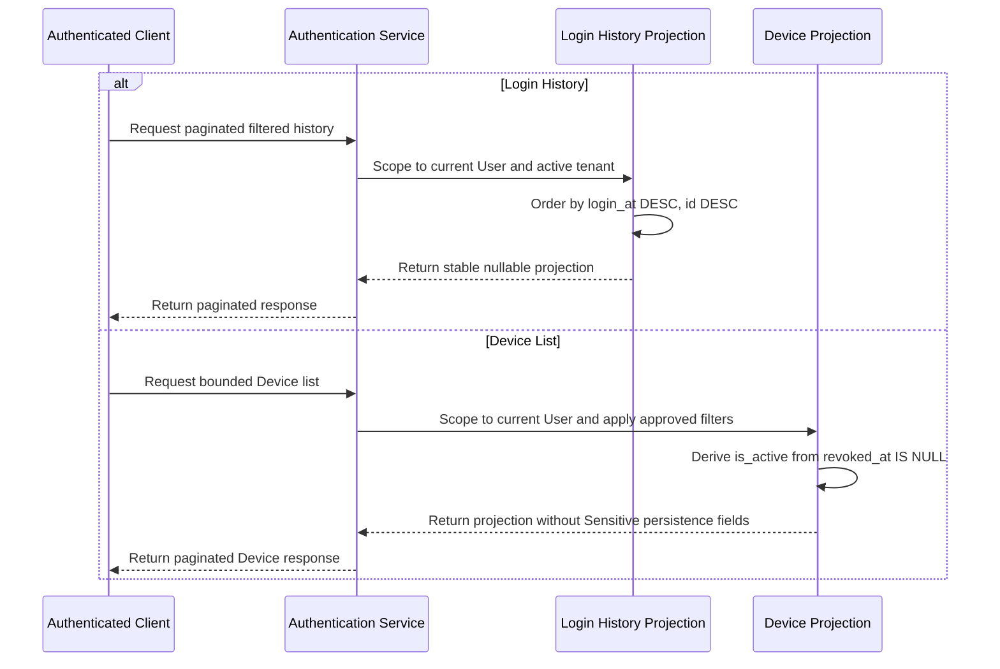
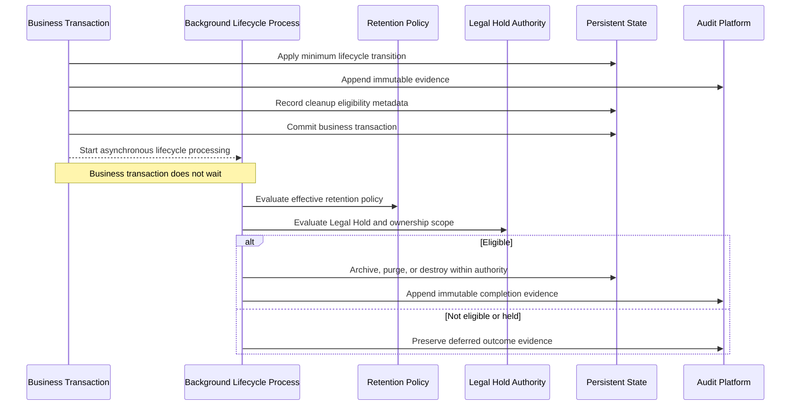

# Authentication Lifecycle Sequence Diagrams

These diagrams synchronize the accepted Authentication behavior with `DD-AUTH-007`, `ADR-005`, `ADR-006`, ADR-001 through ADR-003, and Accepted `DD-AUTH-017`/`DD-AUTH-018`. ADR-004 and DD-AUTH-005 remain superseded historical evidence.

Every Session and Device sequence is self-service, including for Super Admin. Cross-user administration is outside Authentication under Accepted `DD-AUTH-003`.

## Login And Token Issuance

## Login Failure And Distributed Lockout

## Refresh Rotation

## Session And Device Revocation

## Credential Change And Recovery

## Forgot Password Initiation

## Profile Operations

## Login History And Device Lists

## Asynchronous Retention And Cleanup

Background lifecycle operations are idempotent, retry-safe, resumable, bounded, tenant-aware, and auditable. Secret values and hashes never enter Audit Events or archives.
