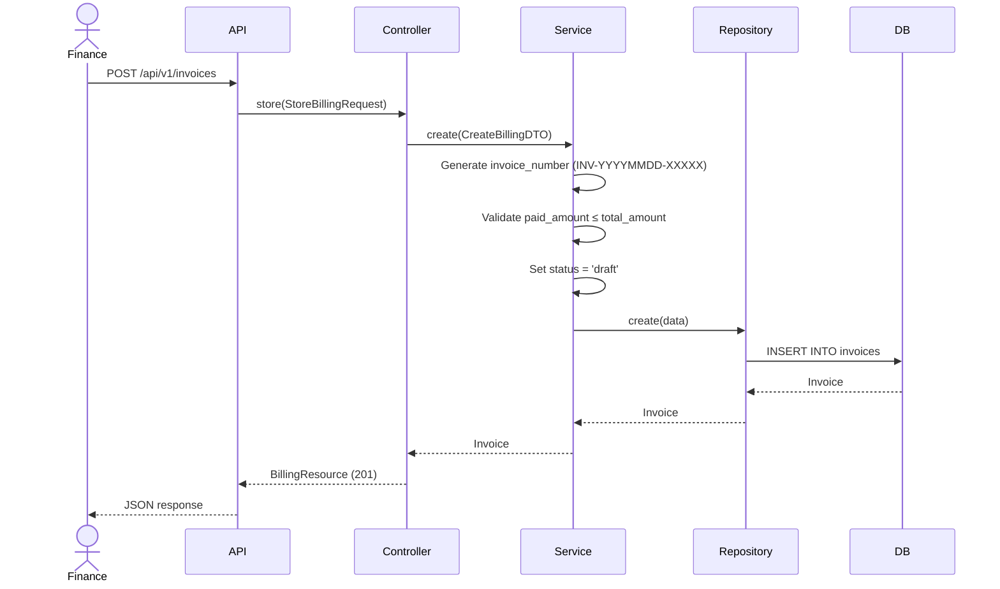
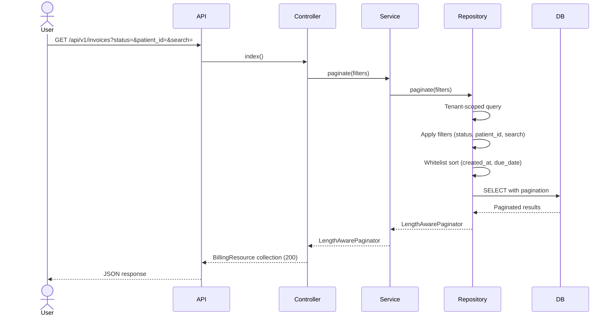
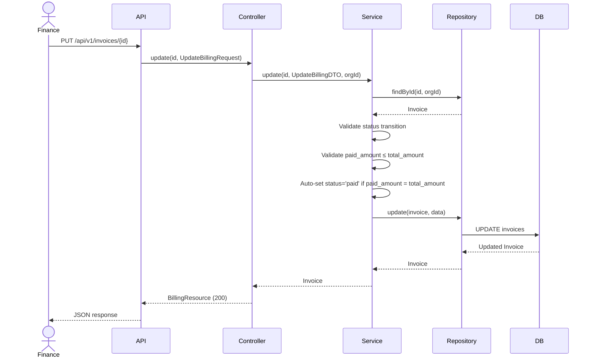
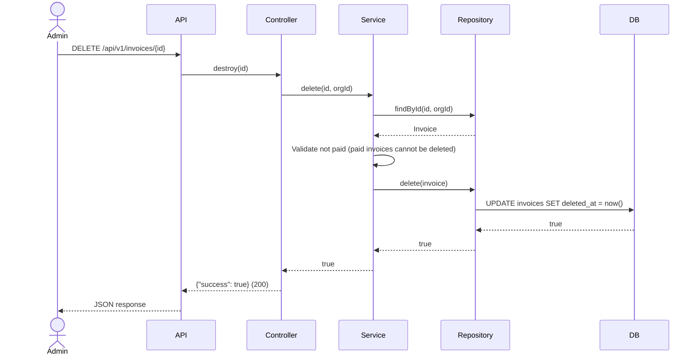
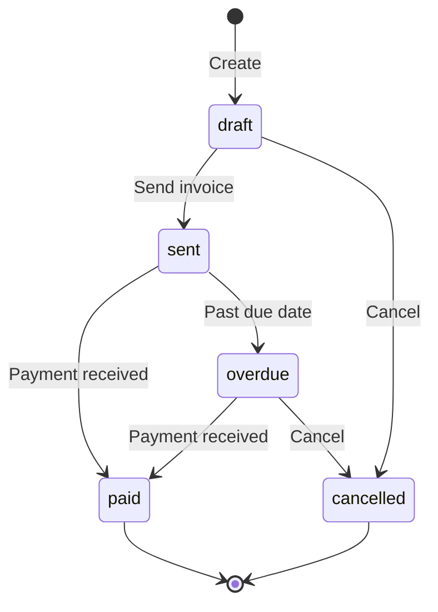

# Phase 17 — Billing Flow

**Date:** 2026-08-17 | **Phase:** 17 — Billing | **Status:** STEP_17_03_DRAFT

## Flows

### 1. Create Invoice

### 2. List Invoices

### 3. Update Invoice & Status Transition

### 4. Delete Invoice

### 5. Status Lifecycle Flow

### Traceability

| Flow | Requirement | Business Rule |
|---|---|---|
| Create | BILL-REQ-001, BILL-REQ-002, BILL-REQ-004, BILL-REQ-005, BILL-REQ-015 | BR-BILL-001, BR-BILL-004, BR-BILL-005 |
| List | BILL-REQ-011, BILL-REQ-012, BILL-REQ-013, BILL-REQ-014 | BR-BILL-015, BR-BILL-016 |
| Update | BILL-REQ-016, BILL-REQ-018 | BR-BILL-008 through BR-BILL-013 |
| Delete | BILL-REQ-017, BILL-REQ-024 | BR-BILL-017 |
| Status Lifecycle | BILL-REQ-007, BILL-REQ-018 | BR-BILL-008 through BR-BILL-013 |