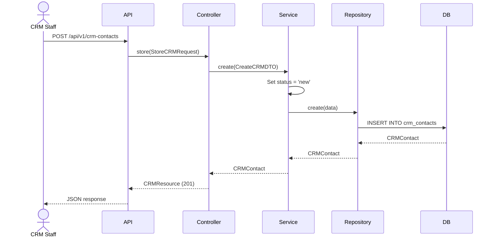
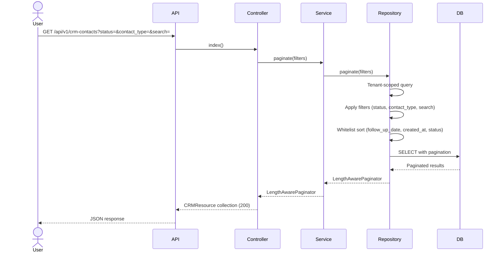
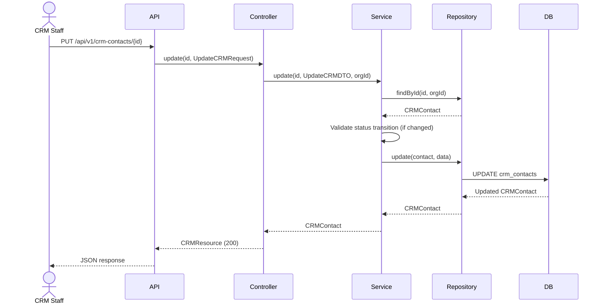
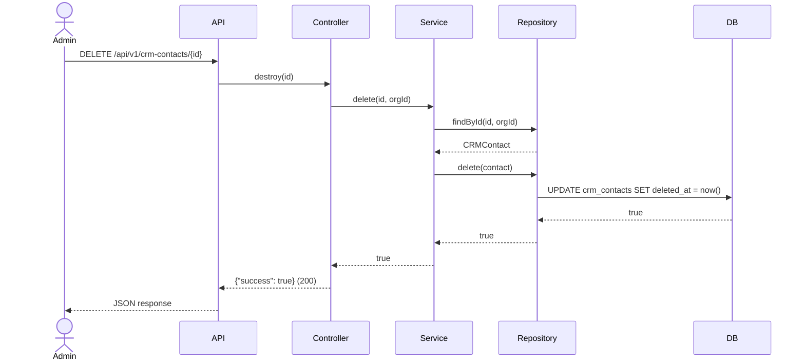

# Phase 24 — CRM Flow

**Date:** 2026-08-17 | **Phase:** 24 — CRM | **Status:** STEP_24_03_DRAFT

## Flows

### 1. Create CRM Contact

### 2. List CRM Contacts

### 3. Update CRM Contact

### 4. Delete CRM Contact

### Traceability

| Flow | Requirement | Business Rule |
|---|---|---|
| Create | CRM-REQ-001, CRM-REQ-002, CRM-REQ-004, CRM-REQ-015 | BR-CRM-001, BR-CRM-003, BR-CRM-004 |
| List | CRM-REQ-011, CRM-REQ-012, CRM-REQ-013, CRM-REQ-014 | BR-CRM-005, BR-CRM-006 |
| Update | CRM-REQ-016 | BR-CRM-012 |
| Delete | CRM-REQ-017 | BR-CRM-007 |