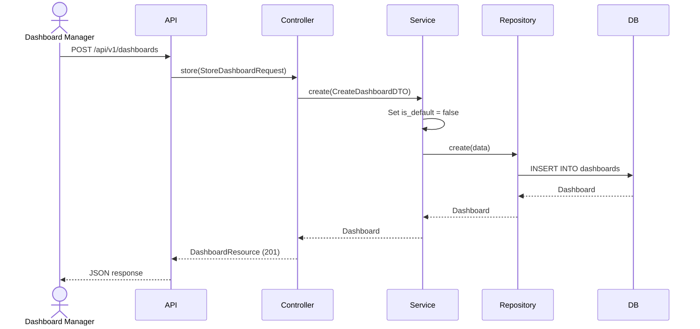
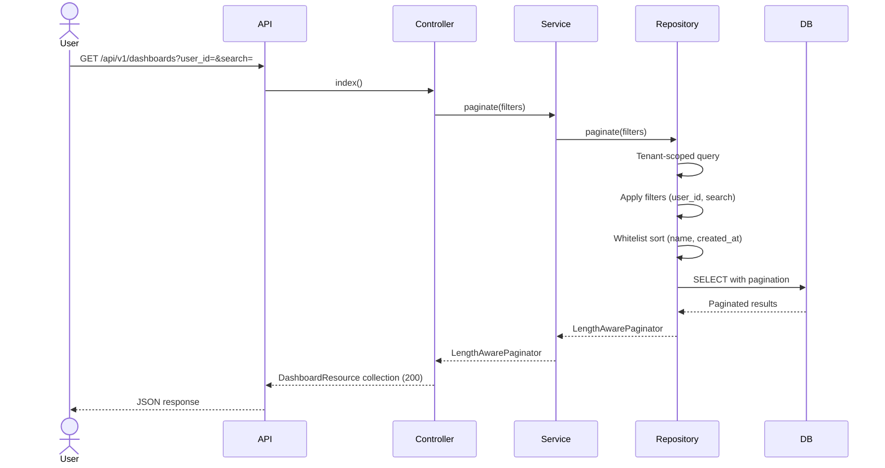
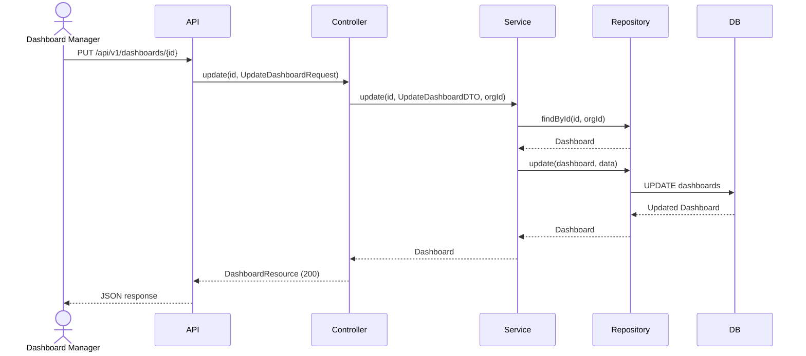
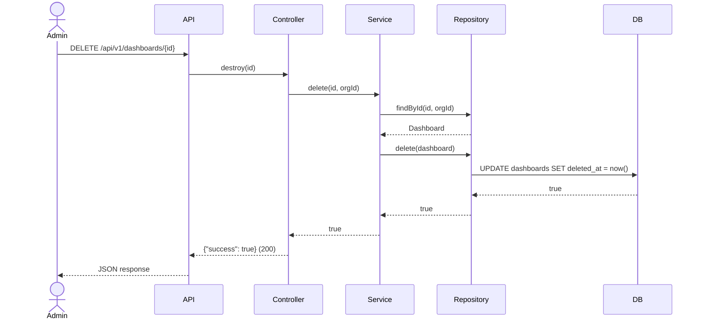

# Phase 26 — Dashboard Flow

**Date:** 2026-08-17 | **Phase:** 26 — Dashboard | **Status:** STEP_26_03_DRAFT

## Flows

### 1. Create Dashboard

### 2. List Dashboards

### 3. Update Dashboard

### 4. Delete Dashboard

### Traceability

| Flow | Requirement | Business Rule |
|---|---|---|
| Create | DASH-REQ-001, DASH-REQ-002, DASH-REQ-004, DASH-REQ-012 | BR-DASH-001, BR-DASH-003, BR-DASH-004 |
| List | DASH-REQ-008, DASH-REQ-009, DASH-REQ-010, DASH-REQ-011 | BR-DASH-005, BR-DASH-006 |
| Update | DASH-REQ-013 | — |
| Delete | DASH-REQ-014 | BR-DASH-007 |