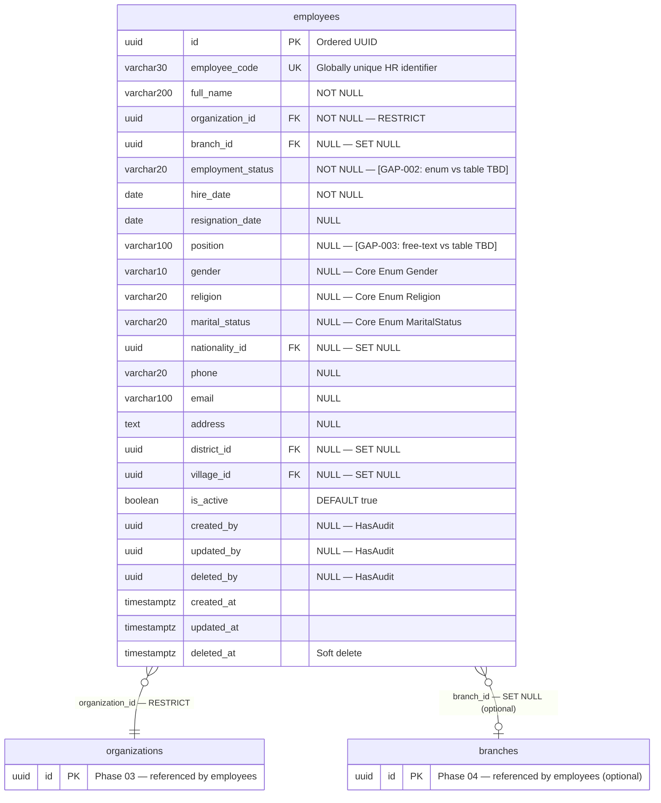

# Phase 10 — Employee ERD

**Date:** 2026-08-10
**Phase:** 10 — Employee
**SDLC Stage:** 04 — Entity Relationship Diagram
**Status:** `STEP_10_10_EMPLOYEE_ERD_DRAFT`

**Traceability:**
- Database Design: `docs/Employee/DatabaseDesign.md` (STEP_10_09_PASS)
- Platform: Phase 07 (commit `99ad776`)
- Master Data: Phase 09 (commit `8be7b26`)

---

## 1. ER Diagram



### 1.1 Governance Decision: User ↔ Employee Bridge

```
┌──────────┐                    ┌───────────┐
│   users  │                    │ employees │
│ (Ph.05)  │                    │ (Ph.10)   │
├──────────┤                    ├───────────┤
│ employee │ ←── LINK ────────→ │ employee  │
│   _code  │   (varchar match)  │   _code   │
│ (UNIQUE, │                    │ (UNIQUE,  │
│  NULL)   │   [EMP-GAP-004:    │  NOT NULL)│
│          │   user_id FK?]     │           │
└──────────┘                    └───────────┘
```

**No `user_id` FK on employees.** The bridge is via matching `employee_code` values. Whether a direct `user_id` FK should be added remains **EMP-GAP-004: REQUIRES DECISION**.

---

## 2. Entity Specification — `employees`

| # | Column | Type | Nullable | Default | Key | FK |
|---|---|---|---|---|---|---|
| 1 | `id` | `uuid` | NOT NULL | — | PK | — |
| 2 | `employee_code` | `varchar(30)` | NOT NULL | — | UK | — |
| 3 | `full_name` | `varchar(200)` | NOT NULL | — | — | — |
| 4 | `organization_id` | `uuid` | NOT NULL | — | — | → `organizations.id` RESTRICT |
| 5 | `branch_id` | `uuid` | NULL | — | — | → `branches.id` SET NULL |
| 6 | `employment_status` | `varchar(20)` | NOT NULL | — | — | — |
| 7 | `hire_date` | `date` | NOT NULL | — | — | — |
| 8 | `resignation_date` | `date` | NULL | — | — | — |
| 9 | `position` | `varchar(100)` | NULL | — | — | — |
| 10 | `gender` | `varchar(10)` | NULL | — | — | — |
| 11 | `religion` | `varchar(20)` | NULL | — | — | — |
| 12 | `marital_status` | `varchar(20)` | NULL | — | — | — |
| 13 | `nationality_id` | `uuid` | NULL | — | — | → `nationalities.id` SET NULL |
| 14 | `phone` | `varchar(20)` | NULL | — | — | — |
| 15 | `email` | `varchar(100)` | NULL | — | — | — |
| 16 | `address` | `text` | NULL | — | — | — |
| 17 | `district_id` | `uuid` | NULL | — | — | → `districts.id` SET NULL |
| 18 | `village_id` | `uuid` | NULL | — | — | → `villages.id` SET NULL |
| 19 | `is_active` | `boolean` | NOT NULL | `true` | — | — |
| 20 | `created_by` | `uuid` | NULL | — | — | — |
| 21 | `updated_by` | `uuid` | NULL | — | — | — |
| 22 | `deleted_by` | `uuid` | NULL | — | — | — |
| 23 | `created_at` | `timestamptz` | NOT NULL | — | — | — |
| 24 | `updated_at` | `timestamptz` | NOT NULL | — | — | — |
| 25 | `deleted_at` | `timestamptz` | NULL | — | — | — |

---

## 3. Relationship Inventory

| # | Child | FK | Parent | Cardinality | ON DELETE | Optional? |
|---|---|---|---|---|---|---|
| 1 | `employees` | `organization_id` | `organizations` | N:1 | RESTRICT | No |
| 2 | `employees` | `branch_id` | `branches` | N:1 | SET NULL | Yes |
| 3 | `employees` | `nationality_id` | `nationalities` | N:1 | SET NULL | Yes |
| 4 | `employees` | `district_id` | `districts` | N:1 | SET NULL | Yes |
| 5 | `employees` | `village_id` | `villages` | N:1 | SET NULL | Yes |

**5 relationships. 0 CASCADE. Consistent with DatabaseDesign.md.**

---

## 4. Constraint & Index Inventory

| Entity | Constraint/Index | Columns | Type |
|---|---|---|---|
| `employees` | PK | `(id)` | PRIMARY KEY |
| `employees` | `employees_employee_code_unique` | `(employee_code)` | UNIQUE |
| `employees` | `employees_org_id_is_active_idx` | `(organization_id, is_active)` | Composite B-tree |
| `employees` | `employees_org_id_branch_id_idx` | `(organization_id, branch_id)` | Composite B-tree |
| `employees` | `employees_employment_status_idx` | `(employment_status)` | B-tree |
| `employees` | `employees_is_active_idx` | `(is_active)` | B-tree |

---

## 5. Governance Decision Points

| ID | Decision | ERD Representation | Status |
|---|---|---|---|
| EMP-GAP-001 | employee_code generation | Column exists; generation TBD | ✅ REQUIRES DECISION |
| EMP-GAP-002 | employment_status mechanism | varchar(20); final type TBD | ✅ REQUIRES DECISION |
| EMP-GAP-003 | position field | varchar(100); final model TBD | ✅ REQUIRES DECISION |
| EMP-GAP-004 | user_id FK | Not in ERD; marked as decision point | ✅ REQUIRES DECISION |
| EMP-GAP-005 | status transitions | No state machine; transitions TBD | ✅ REQUIRES DECISION |

---

## 6. Database Design ↔ ERD Cross-Validation

| Aspect | DatabaseDesign | ERD | Match? |
|---|---|---|---|
| Entities | 1 (`employees`) | 1 | ✅ |
| Columns | 25 | 25 | ✅ |
| PK | UUID ordered | UUID ordered | ✅ |
| FKs | 5 | 5 | ✅ |
| Cardinality | N:1 (all) | N:1 (all) | ✅ |
| ON DELETE | 1 RESTRICT + 4 SET NULL | Same | ✅ |
| UNIQUE | 1 (employee_code) | 1 | ✅ |
| Indexes | 5 | 5 | ✅ |
| Soft delete | deleted_at | deleted_at | ✅ |
| Governance gaps | 5 | 5 preserved | ✅ |

**0 mismatches.**

---

## 7. ERD Summary

| Metric | Count |
|---|---|
| Entities (total) | 3 (1 Employee + 2 existing: organizations, branches) |
| Employee columns | 25 |
| Foreign keys | 5 |
| UNIQUE constraints | 1 |
| Indexes | 5 |
| RESTRICT deletes | 1 |
| SET NULL deletes | 4 |
| CASCADE deletes | 0 |
| Governance gaps | 5 |

---

## Governance Record

| Check | Result |
|---|---|
| Employee entity: 25 columns — exact match to DatabaseDesign.md | ✅ |
| 5 FKs match DatabaseDesign.md (RESTRICT + SET NULL) | ✅ |
| 5 indexes match DatabaseDesign.md | ✅ |
| 5 governance gaps preserved as REQUIRES DECISION | ✅ |
| User bridge: employee_code only, no user_id FK | ✅ EMP-GAP-004 |
| Organization/Branch ownership preserved | ✅ |
| Master Data ownership preserved | ✅ |
| 0 mismatches (entity, column, FK, constraint, index) | ✅ |
| No implementation | ✅ |

STEP_10_10_EMPLOYEE_ERD_DRAFT_PASS
