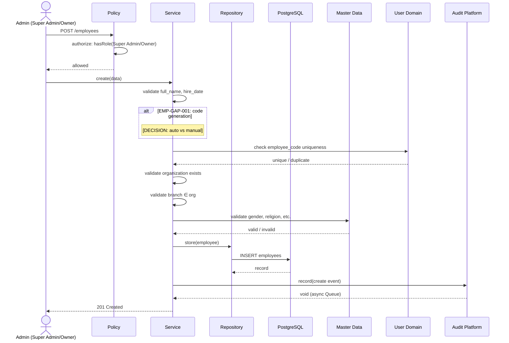

# Phase 10 — Employee Flow

**Date:** 2026-08-09
**Phase:** 10 — Employee
**SDLC Stage:** Design — Flow (Supporting Artifact)
**Status:** `STEP_10_06_EMPLOYEE_FLOW_DRAFT`

**Traceability:**
- Requirements: `docs/Employee/Requirement.md` (STEP_10_03_PASS)
- Business Rules: `docs/Employee/BusinessRule.md` (STEP_10_05_PASS)
- Platform: Phase 07 (commit `99ad776`)
- Auth: Phase 08 (frozen, commit `435c9f9`)
- Master Data: Phase 09 (commit `8be7b26`)

---

## 1. Flow Conventions

| Attribute | Value |
|---|---|
| Flow ID | `FLOW-EMP-NNN` |
| Traceability | `EMP-REQ-NNN` + `EMP-BR-NNN` |
| Governance gap | `EMP-GAP-NNN` |

---

## 2. Employee Creation Flow

### FLOW-EMP-001 — Create Employee

**Trigger:** Super Admin or Owner requests employee creation.
**Actor:** Super Admin / Owner
**Input:** employee_code, full_name, organization_id, branch_id (optional), employment_status, hire_date, position (optional), gender, phone (optional), email (optional), address (optional), geographic references (optional)

**Preconditions:**
- Actor is authenticated and authorized (BR-025)
- Organization exists
- Actor's organization context matches target organization (BR-006, BR-026)

**Validation:**
- `employee_code` not already in use (BR-001, BR-028)
- `full_name` not empty (BR-017)
- `organization_id` references existing organization (BR-005)
- `hire_date` <= today (BR-014)
- If `branch_id` set: branch exists and belongs to same organization (BR-008)
- Master Data references valid (BR-009–012)

**Business Rules:** EMP-BR-001 through EMP-BR-029 (all applicable)

**Process:**
```text
Actor → Auth check → Tenant scope → Validate inputs
    → Check employee_code uniqueness (Employee + User domains)
    → [DECISION POINT: EMP-GAP-001 — resolve employee_code generation policy]
    → Validate organization → Validate branch (org consistency)
    → Validate Master Data references → Validate employment fields
    → Persist Employee record
    → Audit: record creation event (BR-022)
    → Return created Employee
```

**Success:** Employee created with UUID, audit trail recorded.
**Failure:** 422 on validation failure, 403 on unauthorized, 422 on duplicate code.
**Audit:** `AuditServiceInterface::record()` — create event (BR-022)
**Authorization:** Super Admin / Owner (BR-025)
**Tenant:** `organization_id` scoped (BR-006, BR-026)
**Governance:** EMP-GAP-001 (code generation policy)

---

## 3. Employee Update Flow

### FLOW-EMP-002 — Update Employee

**Trigger:** Admin updates employee information.
**Actor:** Super Admin / Owner
**Input:** Any mutable fields: full_name, phone, email, address, position, gender, religion, marital_status, nationality, geographic references, branch_id

**Preconditions:** Employee exists and belongs to actor's organization (BR-006).

**Validation:** Same as create for updated fields. `employee_code` immutability enforced (identity does not change).

**Process:**
```text
Actor → Auth check → Tenant scope → Find employee
    → Verify org scoping → Validate updated fields
    → Validate branch consistency with organization (BR-008)
    → Validate Master Data references (BR-012)
    → Persist changes
    → Audit: record update event
    → Return updated Employee
```

**Audit:** update event (BR-022)
**Authorization:** Super Admin / Owner (BR-025)
**Tenant:** org-scoped (BR-026)

---

## 4. User ↔ Employee Association Flow

### FLOW-EMP-003 — User-Employee Link

**Trigger:** Employee creation or update sets `employee_code` that matches an existing User.
**Actor:** System (automatic resolution) or Admin

**Preconditions:**
- Employee record exists
- User record with matching `employee_code` may or may not exist

**Process:**
```text
Employee create/update with employee_code
    → Check: does a User exist with this employee_code?
    ├─ Yes → Link established (1:1 association, BR-003)
    └─ No  → Employee exists without User association (valid, BR-003)
    → [DECISION POINT: EMP-GAP-004 — whether Employee stores a user_id FK]
    → Association is read-only from Employee side
    → Authentication lifecycle remains with Phase 08
```

**Audit:** link established event
**Governance:** EMP-GAP-004 (user_id FK vs employee_code bridge)

---

## 5. Organization / Branch Assignment Flow

### FLOW-EMP-004 — Organization Assignment

```text
Actor → Auth → Validate organization_id
    → Verify organization exists → Assign employee to organization
    → Tenant context derived from organization (BR-005, BR-006)
```

### FLOW-EMP-005 — Branch Assignment

```text
Actor → Auth → Validate branch_id (optional)
    → Verify branch exists → Verify branch belongs to employee's organization (BR-008)
    → Assign or clear branch
```

**Cross-org prevention:** If branch belongs to different organization → REJECT (BR-008).

---

## 6. Master Data Reference Flow

### FLOW-EMP-006 — Master Data Reference Validation

```text
Employee create/update with Master Data references
    → gender: validate against Gender enum + genders table (BR-009)
    → religion: validate against Religion enum + religions table (BR-010)
    → marital_status: validate against MaritalStatus enum + table (BR-011)
    → nationality: validate against nationalities table
    → geography (district, village): validate against Master Data tables
    → Employee NEVER creates/modifies Master Data (BR-012)
    → Failure: invalid reference → 422
```

---

## 7. Employment Lifecycle Flow

### FLOW-EMP-007 — Employment Status

```text
Actor → Auth → Find employee
    → [DECISION POINT: EMP-GAP-002 — employment_status storage mechanism]
    → [DECISION POINT: EMP-GAP-005 — allowed status transitions]
    → Validate: hire_date present (BR-014)
    → Update status → Audit → Return
```

### FLOW-EMP-008 — Resignation

```text
Actor → Auth → Find employee
    → Validate: resignation_date >= hire_date (BR-015)
    → Set resignation_date (does NOT automatically set is_active=false or status=terminated — BR-021)
    → Audit → Return
```

**Note:** Resignation, deactivation, and termination are distinct per BR-021. No automatic cascading without governance decision.

---

## 8. Active / Inactive Flow

### FLOW-EMP-009 — Toggle Active

```text
Actor → Auth → Find employee → Tenant scope
    → Toggle is_active: true ↔ false (BR-019)
    → Deactivated employees excluded from active lists
    → Reversible — deactivation ≠ termination ≠ resignation (BR-021)
    → Audit → Return
```

---

## 9. Soft Delete Flow

### FLOW-EMP-010 — Soft Delete Employee

```text
Actor → Auth → Find employee → Tenant scope
    → Soft delete via deleted_at (BR-020)
    → No physical row deletion — ever
    → Record excluded from default queries
    → Referential integrity preserved
    → Audit → Return
```

---

## 10. Read Flow

### FLOW-EMP-011 — List Employees

```text
Actor (authenticated) → Tenant scope (org_id mandatory)
    → Query employees for organization → Optionally filter by branch
    → Exclude soft-deleted and optionally inactive
    → Paginate → Include Master Data references → Return
```

### FLOW-EMP-012 — Get Employee Detail

```text
Actor → Auth → Tenant scope → Find by UUID
    → Verify org ownership → Include Master Data references → Return
```

---

## 11. Authorization Flow

### FLOW-EMP-013 — Authorization

```text
Every request:
    → Sanctum Bearer token (Phase 08)
    → Policy evaluation (BR-024, BR-025)
    ├─ Read: all authenticated users (BR-024)
    └─ Write: Super Admin / Owner only (BR-025)
    → 401 if unauthenticated → 403 if unauthorized
```

---

## 12. Audit Flow

### FLOW-EMP-014 — Audit Trail

```text
Every state-changing operation:
    → AuditServiceInterface::record() (Phase 07)
    ├─ Create: actor, org, new record data
    ├─ Update: actor, old/new values
    ├─ Soft Delete: actor, org
    └─ Toggle Active: actor, status change
    → Audit events immutable (BR-023)
```

---

## 13. Tenant Boundary Flow

### FLOW-EMP-015 — Tenant Isolation

```text
Every request:
    → Extract organization context from authenticated actor
    → All queries filter by organization_id (BR-026)
    → Optionally filter by branch_id (BR-027)
    → Cross-org access → REJECT
    → No tenant bypass mechanism exists
```

---

## 14. Error / Rejection Flow

### FLOW-EMP-016 — Error Paths

| Scenario | Behavior | Business Rule |
|---|---|---|
| Unauthenticated | 401 deny | BR-024 |
| Unauthorized write | 403 deny | BR-025 |
| Employee not found | 404 | — |
| Duplicate employee_code | 422 | BR-001 |
| Invalid organization | 422 | BR-005 |
| Branch not in same org | 422 | BR-008 |
| Invalid Master Data reference | 422 | BR-012 |
| hire_date > today | 422 | BR-014 |
| resignation_date < hire_date | 422 | BR-015 |
| Cross-org access attempt | 403 | BR-006 |

---

## 15. Governance Decision Points

| ID | Description | Impacted Flows | Status |
|---|---|---|---|
| EMP-GAP-001 | employee_code generation policy | FLOW-EMP-001 | **REQUIRES DECISION** |
| EMP-GAP-002 | employment_status storage mechanism | FLOW-EMP-007 | **REQUIRES DECISION** |
| EMP-GAP-003 | position field type | FLOW-EMP-001 | **REQUIRES DECISION** |
| EMP-GAP-004 | user_id FK vs employee_code bridge | FLOW-EMP-003 | **REQUIRES DECISION** |
| EMP-GAP-005 | status transitions | FLOW-EMP-007 | **REQUIRES DECISION** |

---

## 16. Flow Traceability Matrix

| Flow ID | Description | Requirements | Business Rules | Governance |
|---|---|---|---|---|
| FLOW-EMP-001 | Create Employee | REQ-001–018 | BR-001–018, BR-028–029 | EMP-GAP-001, 003 |
| FLOW-EMP-002 | Update Employee | REQ-001–018 | BR-001–018 | — |
| FLOW-EMP-003 | User-Employee Link | REQ-003 | BR-003–004 | EMP-GAP-004 |
| FLOW-EMP-004 | Organization Assignment | REQ-005 | BR-005–006 | — |
| FLOW-EMP-005 | Branch Assignment | REQ-006 | BR-007–008 | — |
| FLOW-EMP-006 | Master Data Reference | REQ-007–011 | BR-009–012 | — |
| FLOW-EMP-007 | Employment Status | REQ-012 | BR-013 | EMP-GAP-002, 005 |
| FLOW-EMP-008 | Resignation | REQ-014 | BR-015, BR-021 | — |
| FLOW-EMP-009 | Toggle Active | REQ-019 | BR-019, BR-021 | — |
| FLOW-EMP-010 | Soft Delete | REQ-020 | BR-020–021 | — |
| FLOW-EMP-011 | List Employees | REQ-023 | BR-006, BR-024, BR-026 | — |
| FLOW-EMP-012 | Get Employee Detail | REQ-023 | BR-006, BR-026 | — |
| FLOW-EMP-013 | Authorization | REQ-022 | BR-024–025 | — |
| FLOW-EMP-014 | Audit Trail | REQ-021 | BR-022–023 | — |
| FLOW-EMP-015 | Tenant Isolation | REQ-023 | BR-006, BR-026–027 | — |
| FLOW-EMP-016 | Error Paths | REQ-025 | BR-001,005,008,012,014,015 | — |

**25/25 requirements traced. 29/29 business rules traced. 5/5 governance gaps visible.**

---

## 17. Employee Creation Sequence Diagram



---

## 18. Flow Summary

| Metric | Count |
|---|---|
| Total flows | 16 |
| Requirements traced | 25/25 |
| Business Rules traced | 29/29 |
| Governance decision points | 5 |
| Mermaid diagrams | 1 |

---

## Governance Record

| Check | Result |
|---|---|
| 16 flow sections | ✅ |
| All flows traceable to requirements | ✅ 25/25 |
| All flows traceable to business rules | ✅ 29/29 |
| 5 governance gaps preserved | ✅ |
| No unsupported lifecycle transitions | ✅ |
| No authentication leakage | ✅ |
| No Master Data ownership leakage | ✅ |
| No implementation | ✅ |
| Protected artifacts: 0 modifications | ✅ |

STEP_10_06_EMPLOYEE_FLOW_DRAFT_PASS
