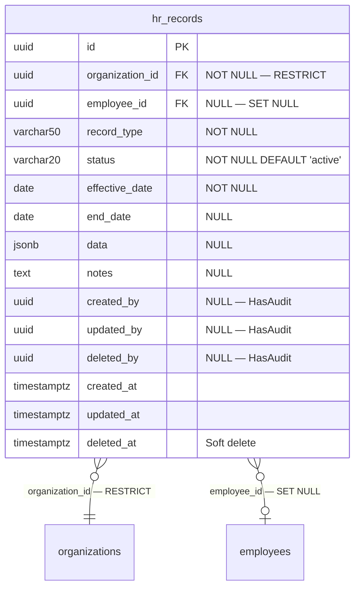

# Phase 23 — HR ERD

**Date:** 2026-08-17 | **Phase:** 23 — HR | **Status:** STEP_23_04_DRAFT

## 1. Entity — `hr_records`



## 2. Entity Specification

| # | Column | Type | Nullable | Default | Key | FK |
|---|---|---|---|---|---|---|
| 1 | `id` | `uuid` | NOT NULL | — | PK | — |
| 2 | `organization_id` | `uuid` | NOT NULL | — | — | → organizations.id RESTRICT |
| 3 | `employee_id` | `uuid` | NULL | — | — | → employees.id SET NULL |
| 4 | `record_type` | `varchar(50)` | NOT NULL | — | — | — |
| 5 | `status` | `varchar(20)` | NOT NULL | `active` | — | — |
| 6 | `effective_date` | `date` | NOT NULL | — | — | — |
| 7 | `end_date` | `date` | NULL | — | — | — |
| 8 | `data` | `jsonb` | NULL | — | — | — |
| 9 | `notes` | `text` | NULL | — | — | — |
| 10 | `created_by` | `uuid` | NULL | — | — | — |
| 11 | `updated_by` | `uuid` | NULL | — | — | — |
| 12 | `deleted_by` | `uuid` | NULL | — | — | — |
| 13 | `created_at` | `timestamptz` | NOT NULL | CURRENT_TIMESTAMP | — | — |
| 14 | `updated_at` | `timestamptz` | NULL | — | — | — |
| 15 | `deleted_at` | `timestamptz` | NULL | — | — | — |

**15 columns.**

## 3. Relationship Inventory

| # | Child | FK | Parent | Cardinality | ON DELETE | Optional? |
|---|---|---|---|---|---|---|
| 1 | `hr_records` | `organization_id` | `organizations` | N:1 | RESTRICT | No |
| 2 | `hr_records` | `employee_id` | `employees` | N:1 | SET NULL | Yes |

**2 relationships. 0 CASCADE.**

## 4. Constraint & Index Inventory

| Entity | Constraint/Index | Columns | Type |
|---|---|---|---|
| `hr_records` | PK | `(id)` | PRIMARY KEY |
| `hr_records` | `hr_records_org_record_type_idx` | `(organization_id, record_type)` | Composite B-tree |
| `hr_records` | `hr_records_employee_id_idx` | `(employee_id)` | B-tree |
| `hr_records` | `hr_records_effective_date_idx` | `(effective_date)` | B-tree |

**4 indexes (1 PK + 3 composite/single).**

## 5. Model Guidance

```php
use App\Core\Base\BaseModel;

class HR extends BaseModel
{
    protected $table = 'hr_records';

    protected $casts = [
        'effective_date' => 'date',
        'end_date'       => 'date',
        'data'           => 'array',
        'created_at'     => 'datetime',
        'updated_at'     => 'datetime',
        'deleted_at'     => 'datetime',
    ];
}
```

- Extends `BaseModel` (HasUuid, HasAudit, SoftDeletes, $guarded=[])