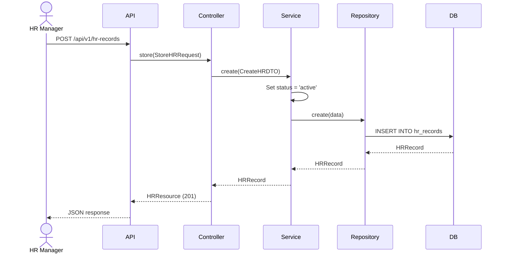
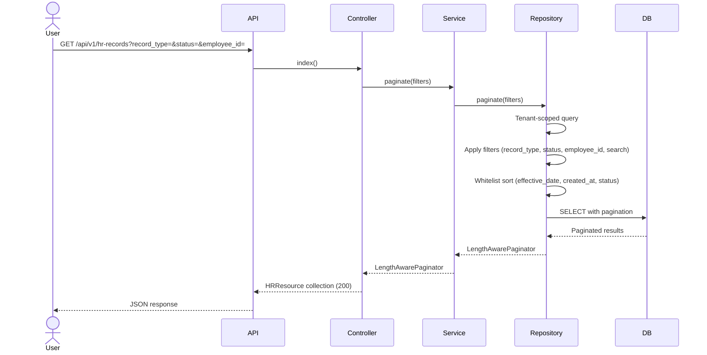
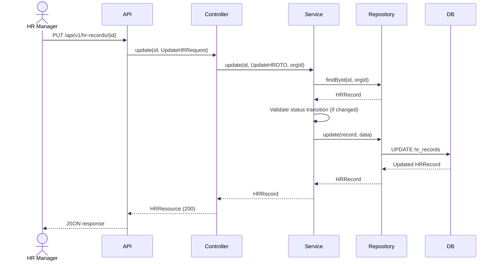
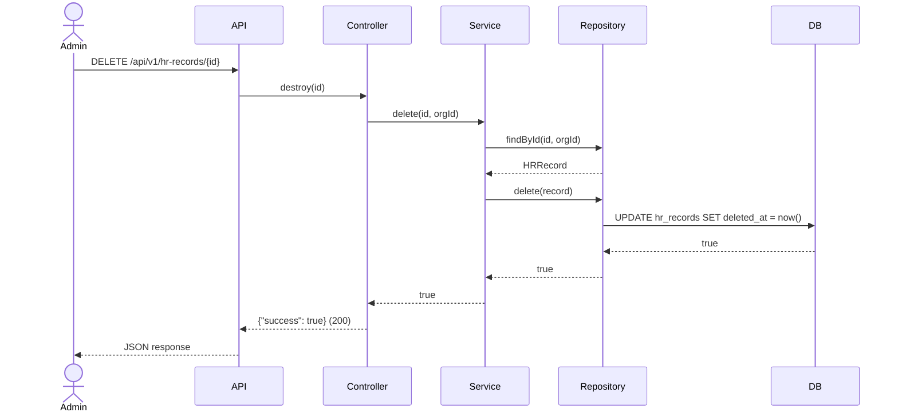

# Phase 23 — HR Flow

**Date:** 2026-08-17 | **Phase:** 23 — HR | **Status:** STEP_23_03_DRAFT

## Flows

### 1. Create HR Record

### 2. List HR Records

### 3. Update HR Record

### 4. Delete HR Record

### Traceability

| Flow | Requirement | Business Rule |
|---|---|---|
| Create | HR-REQ-001, HR-REQ-002, HR-REQ-004, HR-REQ-006, HR-REQ-014 | BR-HR-001, BR-HR-003, BR-HR-004, BR-HR-005 |
| List | HR-REQ-010, HR-REQ-011, HR-REQ-012, HR-REQ-013 | BR-HR-007, BR-HR-008 |
| Update | HR-REQ-015 | BR-HR-014 |
| Delete | HR-REQ-016 | BR-HR-009 |