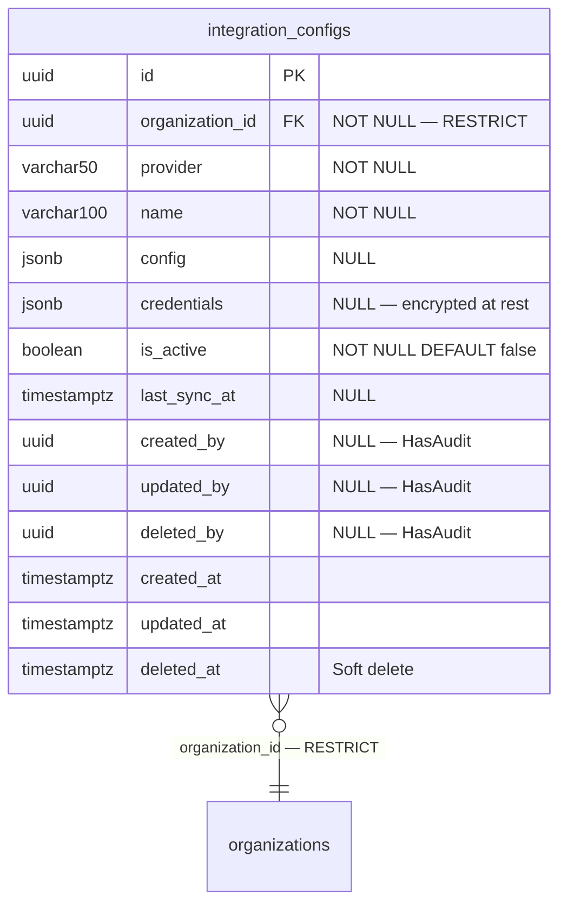

# Phase 27 — Integration Hub ERD

**Date:** 2026-08-17 | **Phase:** 27 — Integration Hub | **Status:** STEP_27_04_DRAFT

## 1. Entity — `integration_configs`



## 2. Entity Specification

| # | Column | Type | Nullable | Default | Key | FK |
|---|---|---|---|---|---|---|
| 1 | `id` | `uuid` | NOT NULL | — | PK | — |
| 2 | `organization_id` | `uuid` | NOT NULL | — | — | → organizations.id RESTRICT |
| 3 | `provider` | `varchar(50)` | NOT NULL | — | — | — |
| 4 | `name` | `varchar(100)` | NOT NULL | — | — | — |
| 5 | `config` | `jsonb` | NULL | — | — | — |
| 6 | `credentials` | `jsonb` | NULL | — | — | — |
| 7 | `is_active` | `boolean` | NOT NULL | `false` | — | — |
| 8 | `last_sync_at` | `timestamptz` | NULL | — | — | — |
| 9 | `created_by` | `uuid` | NULL | — | — | — |
| 10 | `updated_by` | `uuid` | NULL | — | — | — |
| 11 | `deleted_by` | `uuid` | NULL | — | — | — |
| 12 | `created_at` | `timestamptz` | NOT NULL | CURRENT_TIMESTAMP | — | — |
| 13 | `updated_at` | `timestamptz` | NULL | — | — | — |
| 14 | `deleted_at` | `timestamptz` | NULL | — | — | — |

**14 columns. 1 FK. 1 index.**

## 3. Relationship Inventory

| # | Child | FK | Parent | Cardinality | ON DELETE | Optional? |
|---|---|---|---|---|---|---|
| 1 | `integration_configs` | `organization_id` | `organizations` | N:1 | RESTRICT | No |

**1 relationship. 0 CASCADE.**

## 4. Constraint & Index Inventory

| Entity | Constraint/Index | Columns | Type |
|---|---|---|---|
| `integration_configs` | PK | `(id)` | PRIMARY KEY |
| `integration_configs` | `integration_configs_org_provider_idx` | `(organization_id, provider)` | Composite B-tree |

**2 indexes (1 PK + 1 composite).**

## 5. Model Guidance

```php
use App\Core\Base\BaseModel;

class IntegrationHub extends BaseModel
{
    protected $table = 'integration_configs';

    protected $casts = [
        'config'        => 'array',
        'credentials'   => 'encrypted',
        'is_active'     => 'boolean',
        'last_sync_at'  => 'datetime',
        'created_at'    => 'datetime',
        'updated_at'    => 'datetime',
        'deleted_at'    => 'datetime',
    ];

    protected $hidden = [
        'credentials',
    ];
}
```

- Extends `BaseModel` (HasUuid, HasAudit, SoftDeletes, $guarded=[])
- `credentials` cast to `encrypted` — Laravel encrypts/decrypts automatically
- `credentials` hidden from serialization — model-level protection
- `config` cast to `array` — JSONB ↔ PHP array