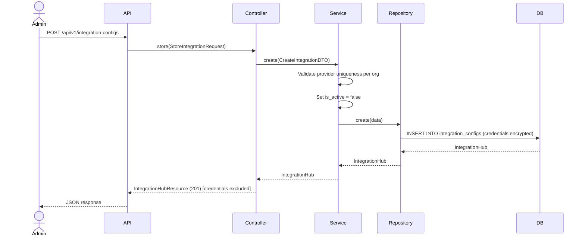
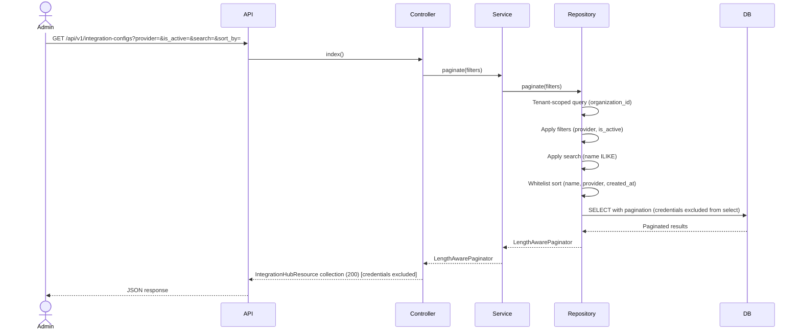
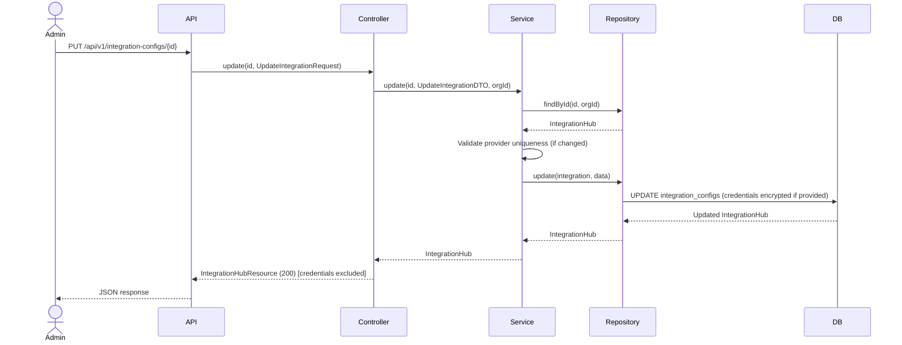
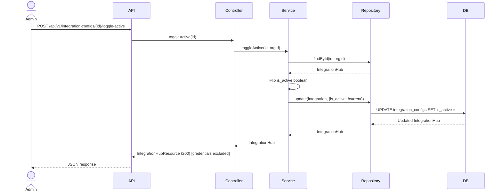
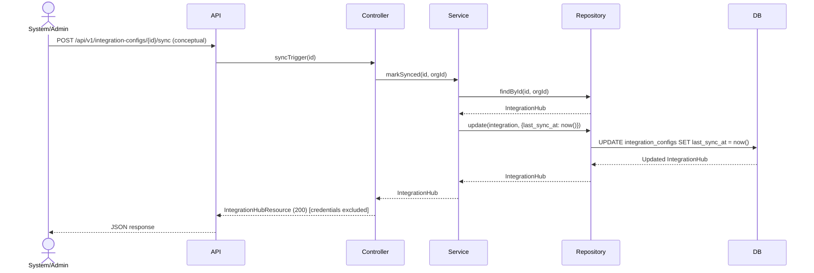

# Phase 27 — Integration Hub Flow

**Date:** 2026-08-17 | **Phase:** 27 — Integration Hub | **Status:** STEP_27_03_DRAFT

## Flows

### 1. Create Integration Config

### 2. List Integration Configs

### 3. Update Integration Config

### 4. Toggle Active

### 5. Sync Trigger (updates last_sync_at)

### Traceability

| Flow | Requirement | Business Rule |
|---|---|---|
| Create | INT-REQ-001, INT-REQ-002, INT-REQ-003, INT-REQ-004, INT-REQ-005, INT-REQ-006, INT-REQ-007, INT-REQ-016 | BR-INT-001, BR-INT-002, BR-INT-003, BR-INT-004, BR-INT-005, BR-INT-007, BR-INT-016 |
| List | INT-REQ-012, INT-REQ-013, INT-REQ-014, INT-REQ-015 | BR-INT-009, BR-INT-010 |
| Update | INT-REQ-017 | BR-INT-004, BR-INT-017 |
| Toggle Active | INT-REQ-019 | BR-INT-008 |
| Sync Trigger | INT-REQ-025 | BR-INT-019 |