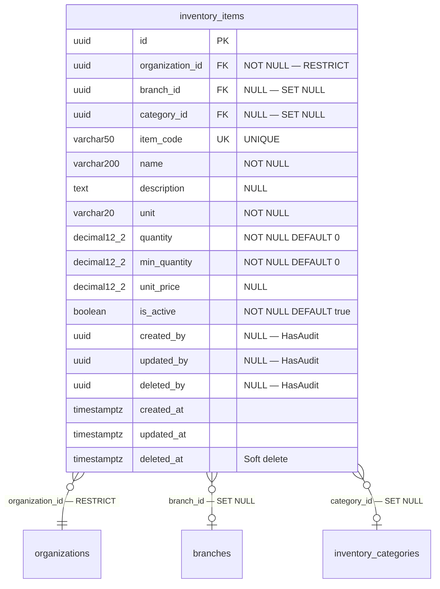

# Phase 18 — Inventory ERD

**Date:** 2026-08-17 | **Phase:** 18 — Inventory | **Status:** STEP_18_04_DRAFT

## 1. Entity — `inventory_items`



## 2. Entity Specification

| # | Column | Type | Nullable | Default | Key | FK |
|---|---|---|---|---|---|---|
| 1 | `id` | `uuid` | NOT NULL | — | PK | — |
| 2 | `organization_id` | `uuid` | NOT NULL | — | — | → organizations.id RESTRICT |
| 3 | `branch_id` | `uuid` | NULL | — | — | → branches.id SET NULL |
| 4 | `category_id` | `uuid` | NULL | — | — | → inventory_categories.id SET NULL |
| 5 | `item_code` | `varchar(50)` | NOT NULL | — | UK | — |
| 6 | `name` | `varchar(200)` | NOT NULL | — | — | — |
| 7 | `description` | `text` | NULL | — | — | — |
| 8 | `unit` | `varchar(20)` | NOT NULL | — | — | — |
| 9 | `quantity` | `decimal(12,2)` | NOT NULL | `0` | — | — |
| 10 | `min_quantity` | `decimal(12,2)` | NOT NULL | `0` | — | — |
| 11 | `unit_price` | `decimal(12,2)` | NULL | — | — | — |
| 12 | `is_active` | `boolean` | NOT NULL | `true` | — | — |
| 13 | `created_by` | `uuid` | NULL | — | — | — |
| 14 | `updated_by` | `uuid` | NULL | — | — | — |
| 15 | `deleted_by` | `uuid` | NULL | — | — | — |
| 16 | `created_at` | `timestamptz` | NOT NULL | CURRENT_TIMESTAMP | — | — |
| 17 | `updated_at` | `timestamptz` | NULL | — | — | — |
| 18 | `deleted_at` | `timestamptz` | NULL | — | — | — |

**18 columns.**

## 3. Relationship Inventory

| # | Child | FK | Parent | Cardinality | ON DELETE | Optional? |
|---|---|---|---|---|---|---|
| 1 | `inventory_items` | `organization_id` | `organizations` | N:1 | RESTRICT | No |
| 2 | `inventory_items` | `branch_id` | `branches` | N:1 | SET NULL | Yes |
| 3 | `inventory_items` | `category_id` | `inventory_categories` | N:1 | SET NULL | Yes |

**3 relationships. 0 CASCADE.**

## 4. Constraint & Index Inventory

| Entity | Constraint/Index | Columns | Type |
|---|---|---|---|
| `inventory_items` | PK | `(id)` | PRIMARY KEY |
| `inventory_items` | `inventory_items_item_code_unique` | `(item_code)` | UNIQUE |
| `inventory_items` | `inventory_items_org_is_active_idx` | `(organization_id, is_active)` | Composite B-tree |
| `inventory_items` | `inventory_items_org_branch_idx` | `(organization_id, branch_id)` | Composite B-tree |

**4 indexes (1 PK + 1 UK + 2 composite).**

## 5. Model Guidance

```php
use App\Core\Base\BaseModel;

class Inventory extends BaseModel
{
    protected $table = 'inventory_items';

    protected $casts = [
        'quantity'     => 'decimal:2',
        'min_quantity' => 'decimal:2',
        'unit_price'   => 'decimal:2',
        'is_active'    => 'boolean',
        'created_at'   => 'datetime',
        'updated_at'   => 'datetime',
        'deleted_at'   => 'datetime',
    ];
}
```

- Extends `BaseModel` (HasUuid, HasAudit, SoftDeletes, $guarded=[])
- `is_active` cast to `boolean`