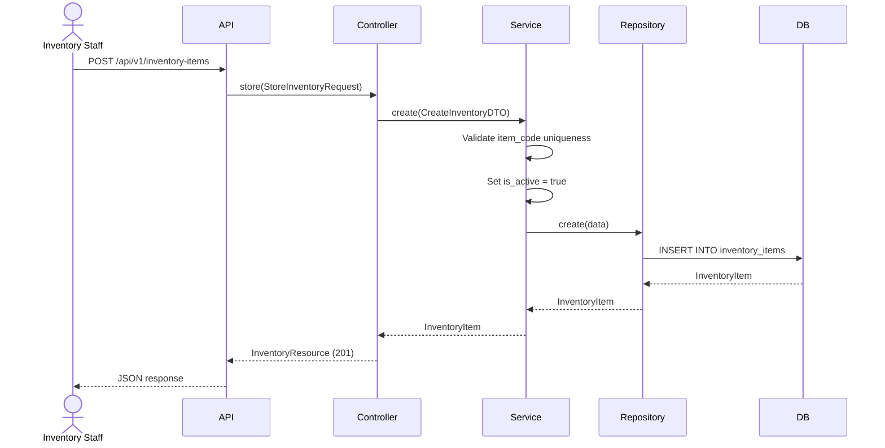
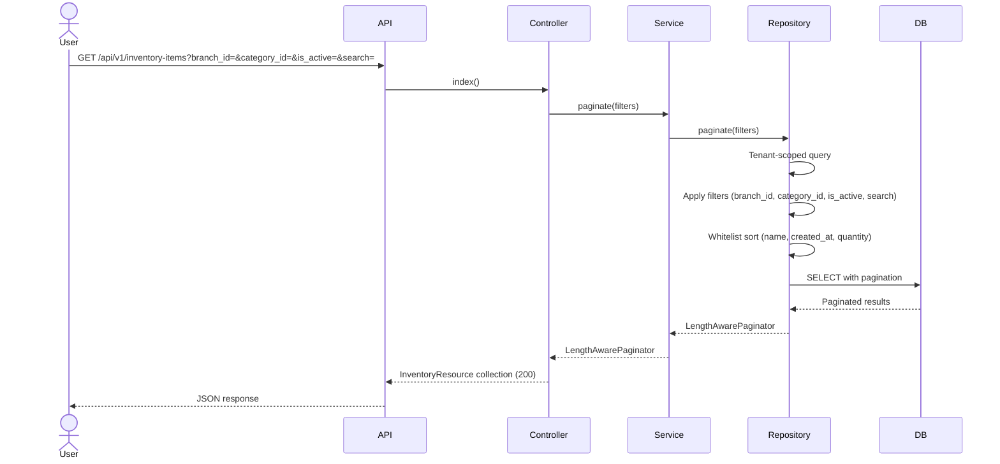
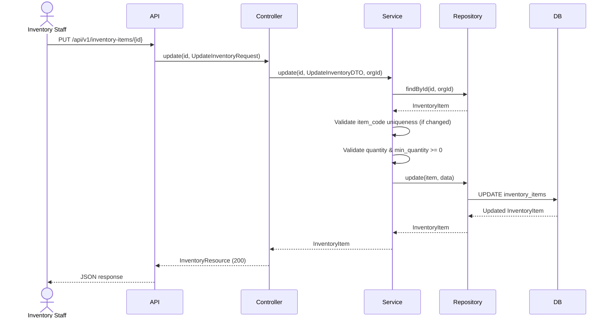
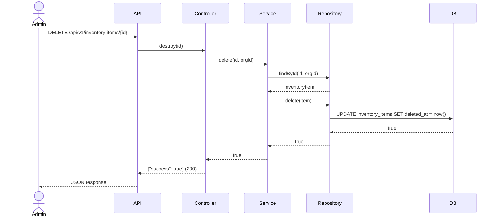
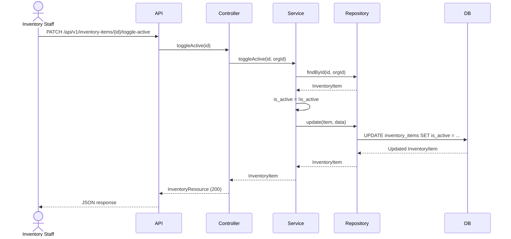

# Phase 18 — Inventory Flow

**Date:** 2026-08-17 | **Phase:** 18 — Inventory | **Status:** STEP_18_03_DRAFT

## Flows

### 1. Create Inventory Item

### 2. List Inventory Items

### 3. Update Inventory Item

### 4. Delete Inventory Item

### 5. Toggle Active Status

### Traceability

| Flow | Requirement | Business Rule |
|---|---|---|
| Create | INV-REQ-001, INV-REQ-002, INV-REQ-005, INV-REQ-006, INV-REQ-008, INV-REQ-017 | BR-INV-001, BR-INV-004, BR-INV-005, BR-INV-006, BR-INV-010, BR-INV-019 |
| List | INV-REQ-013, INV-REQ-014, INV-REQ-015, INV-REQ-016 | BR-INV-012, BR-INV-013 |
| Update | INV-REQ-018 | BR-INV-004, BR-INV-007, BR-INV-008, BR-INV-009, BR-INV-020 |
| Delete | INV-REQ-019 | BR-INV-014 |
| Toggle Active | INV-REQ-020 | BR-INV-011 |