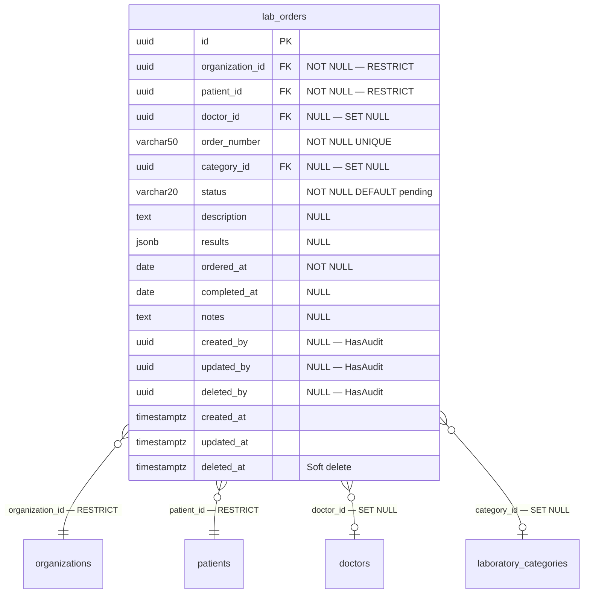

# Phase 20 — Laboratory ERD

**Date:** 2026-08-17 | **Phase:** 20 — Laboratory | **Status:** STEP_20_04_DRAFT

## 1. Entity — `lab_orders`



## 2. Entity Specification

| # | Column | Type | Nullable | Default | Key | FK |
|---|---|---|---|---|---|---|
| 1 | `id` | `uuid` | NOT NULL | — | PK | — |
| 2 | `organization_id` | `uuid` | NOT NULL | — | — | → organizations.id RESTRICT |
| 3 | `patient_id` | `uuid` | NOT NULL | — | — | → patients.id RESTRICT |
| 4 | `doctor_id` | `uuid` | NULL | — | — | → doctors.id SET NULL |
| 5 | `order_number` | `varchar(50)` | NOT NULL | — | UNIQUE | — |
| 6 | `category_id` | `uuid` | NULL | — | — | → laboratory_categories.id SET NULL |
| 7 | `status` | `varchar(20)` | NOT NULL | `pending` | — | — |
| 8 | `description` | `text` | NULL | — | — | — |
| 9 | `results` | `jsonb` | NULL | — | — | — |
| 10 | `ordered_at` | `date` | NOT NULL | — | — | — |
| 11 | `completed_at` | `date` | NULL | — | — | — |
| 12 | `notes` | `text` | NULL | — | — | — |
| 13 | `created_by` | `uuid` | NULL | — | — | — |
| 14 | `updated_by` | `uuid` | NULL | — | — | — |
| 15 | `deleted_by` | `uuid` | NULL | — | — | — |
| 16 | `created_at` | `timestamptz` | NOT NULL | CURRENT_TIMESTAMP | — | — |
| 17 | `updated_at` | `timestamptz` | NULL | — | — | — |
| 18 | `deleted_at` | `timestamptz` | NULL | — | — | — |

**18 columns.**

## 3. Relationship Inventory

| # | Child | FK | Parent | Cardinality | ON DELETE | Optional? |
|---|---|---|---|---|---|---|
| 1 | `lab_orders` | `organization_id` | `organizations` | N:1 | RESTRICT | No |
| 2 | `lab_orders` | `patient_id` | `patients` | N:1 | RESTRICT | No |
| 3 | `lab_orders` | `doctor_id` | `doctors` | N:1 | SET NULL | Yes |
| 4 | `lab_orders` | `category_id` | `laboratory_categories` | N:1 | SET NULL | Yes |

**4 relationships. 0 CASCADE.**

## 4. Constraint & Index Inventory

| Entity | Constraint/Index | Columns | Type |
|---|---|---|---|
| `lab_orders` | PK | `(id)` | PRIMARY KEY |
| `lab_orders` | `lab_orders_order_number_unique` | `(order_number)` | UNIQUE B-tree |
| `lab_orders` | `lab_orders_org_status_idx` | `(organization_id, status)` | Composite B-tree |
| `lab_orders` | `lab_orders_patient_id_idx` | `(patient_id)` | B-tree |

**4 indexes (1 PK + 1 UNIQUE + 2 BTREE).**

## 5. Model Guidance

```php
use App\Core\Base\BaseModel;

class Laboratory extends BaseModel
{
    protected $table = 'lab_orders';

    protected $casts = [
        'ordered_at'   => 'date',
        'completed_at' => 'date',
        'results'      => 'array',
        'created_at'   => 'datetime',
        'updated_at'   => 'datetime',
        'deleted_at'   => 'datetime',
    ];
}
```

- Extends `BaseModel` (HasUuid, HasAudit, SoftDeletes, $guarded=[])
- `results` cast to `array` for JSONB column
- `ordered_at` and `completed_at` cast to `date`
- `status` enum: `LabOrderStatus` (pending, in_progress, completed, cancelled)