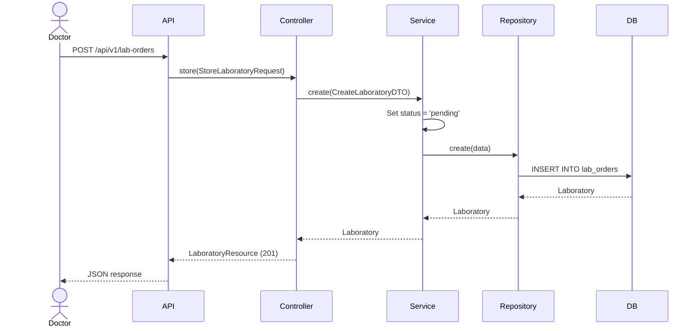
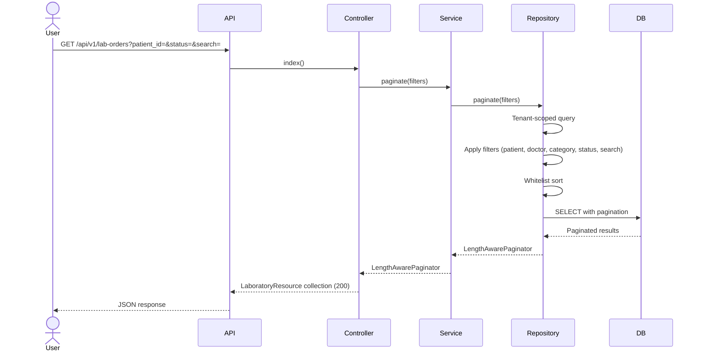
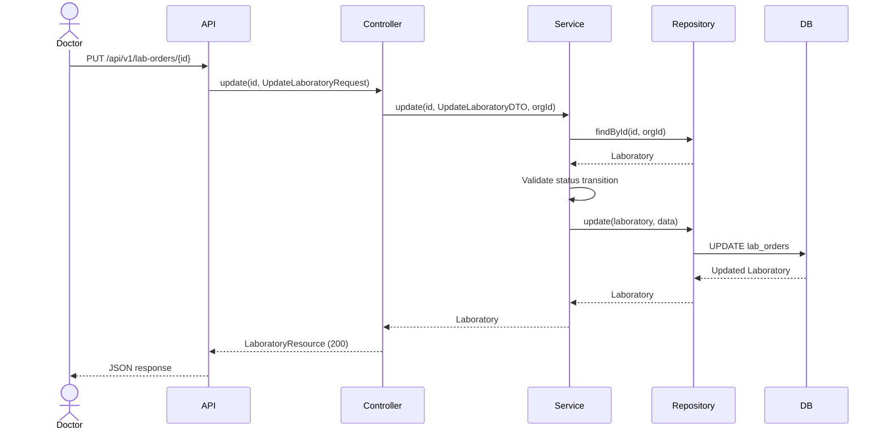
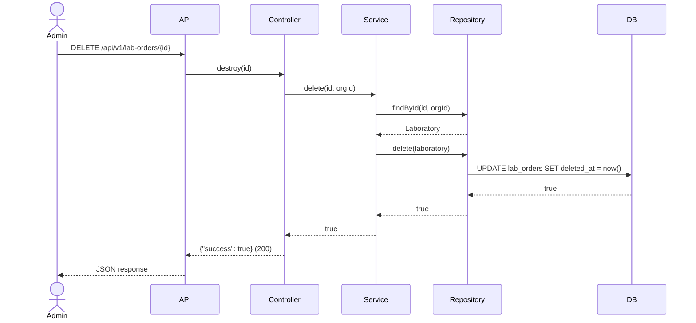
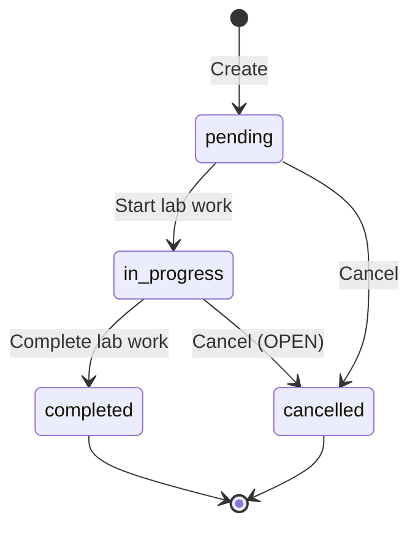

# Phase 20 — Laboratory Flow

**Date:** 2026-08-17 | **Phase:** 20 — Laboratory | **Status:** STEP_20_03_DRAFT

## Flows

### 1. Create Lab Order

### 2. List Lab Orders

### 3. Update Lab Order

### 4. Delete Lab Order

### 5. Status Lifecycle Flow

### Traceability

| Flow | Requirement | Business Rule |
|---|---|---|
| Create | LAB-REQ-001, LAB-REQ-002, LAB-REQ-003, LAB-REQ-005, LAB-REQ-017 | BR-LAB-001, BR-LAB-002, BR-LAB-005 |
| List | LAB-REQ-013, LAB-REQ-014, LAB-REQ-015, LAB-REQ-016 | BR-LAB-015, BR-LAB-016 |
| Update | LAB-REQ-018, LAB-REQ-020 | BR-LAB-008, BR-LAB-009, BR-LAB-010, BR-LAB-011 |
| Delete | LAB-REQ-019 | BR-LAB-017 |
| Status Lifecycle | LAB-REQ-007, LAB-REQ-020 | BR-LAB-007, BR-LAB-008, BR-LAB-009, BR-LAB-010, BR-LAB-011 |