# Phase 09 — Master Data ERD

**Date:** 2026-08-09
**Phase:** 09 — Master Data
**SDLC Stage:** 04 — Entity Relationship Diagram
**Status:** `STEP_09_10_MASTER_DATA_ERD_DRAFT`

**Traceability:**
- Requirements: `docs/MasterData/Requirement.md` (STEP_09_03_PASS)
- Business Rules: `docs/MasterData/BusinessRule.md` (STEP_09_05_PASS)
- Flow: `docs/MasterData/Flow.md` (STEP_09_07_PASS)
- Database Design: `docs/MasterData/DatabaseDesign.md` (STEP_09_09_PASS)
- Source Schemas: `database_design/005_MasterData.md`, `006_MasterDataFoundation.md`

---

## 1. ER Diagram

```mermaid
erDiagram
    countries {
        uuid id PK "Ordered UUID"
        varchar code UK "ISO 3166-1 — UNIQUE"
        varchar name "NOT NULL"
        varchar name_local "NULL — local name"
        varchar phone_code "NULL — dialing code"
        boolean is_active "DEFAULT true"
        uuid created_by "NULL — HasAudit"
        uuid updated_by "NULL — HasAudit"
        uuid deleted_by "NULL — HasAudit"
        timestamptz created_at "NOT NULL"
        timestamptz updated_at "NOT NULL"
        timestamptz deleted_at "NULL — soft delete"
    }

    provinces {
        uuid id PK
        uuid country_id FK "NOT NULL — RESTRICT"
        varchar code UK "BPS code — UNIQUE"
        varchar name "NOT NULL"
        boolean is_active "DEFAULT true"
        uuid created_by "NULL"
        uuid updated_by "NULL"
        uuid deleted_by "NULL"
        timestamptz created_at
        timestamptz updated_at
        timestamptz deleted_at "soft delete"
    }

    cities {
        uuid id PK
        uuid province_id FK "NOT NULL — RESTRICT"
        varchar code UK "BPS code — UNIQUE"
        varchar name "NOT NULL"
        boolean is_active
        uuid created_by
        uuid updated_by
        uuid deleted_by
        timestamptz created_at
        timestamptz updated_at
        timestamptz deleted_at
    }

    districts {
        uuid id PK
        uuid city_id FK "NOT NULL — RESTRICT"
        varchar code UK "BPS code — UNIQUE"
        varchar name "NOT NULL"
        boolean is_active
        uuid created_by
        uuid updated_by
        uuid deleted_by
        timestamptz created_at
        timestamptz updated_at
        timestamptz deleted_at
    }

    villages {
        uuid id PK
        uuid district_id FK "NOT NULL — RESTRICT"
        varchar code UK "BPS code — UNIQUE"
        varchar name "NOT NULL"
        varchar postal_code "NULL"
        boolean is_active
        uuid created_by
        uuid updated_by
        uuid deleted_by
        timestamptz created_at
        timestamptz updated_at
        timestamptz deleted_at
    }

    countries ||--o{ provinces : "country_id — RESTRICT"
    provinces ||--o{ cities : "province_id — RESTRICT"
    cities ||--o{ districts : "city_id — RESTRICT"
    districts ||--o{ villages : "district_id — RESTRICT"
```



### 1.1 Independent Tables (No Cross-Table FKs)

The remaining 18 Master Data tables are structurally independent — they share the common base columns but have **no foreign keys** to other Master Data tables.

```text
┌────────────────────────────────────────┐
│  Group B — Locale (4 tables)           │
│  currencies  timezones  languages      │
│  nationalities                         │
│  [base cols only, no FKs]              │
├────────────────────────────────────────┤
│  Group C — Demographic (4 tables)      │
│  genders  religions  blood_types       │
│  marital_statuses                      │
│  [base cols only, no FKs]              │
├────────────────────────────────────────┤
│  Group D — Clinical (5 tables)         │
│  patient_types  doctor_specialties     │
│  treatment_categories                  │
│  appointment_statuses(+label_color)    │
│  laboratory_categories                 │
│  [base cols + label_color, no FKs]      │
├────────────────────────────────────────┤
│  Group E — Financial (3 tables)        │
│  payment_methods  insurance_companies  │
│  tax_rates(+rate_percentage,eff_date)  │
│  [base cols + rate fields, no FKs]     │
├────────────────────────────────────────┤
│  Group F — Operational (2 tables)      │
│  asset_categories                      │
│  inventory_categories                  │
│  [base cols only, no FKs]              │
└────────────────────────────────────────┘
```

---

## 2. Entity Specifications

### 2.1 `countries`

| # | Column | Type | Nullable | Default | Key | FK |
|---|---|---|---|---|---|---|
| 1 | `id` | `uuid` | NOT NULL | — | PK | — |
| 2 | `code` | `varchar(3)` | NOT NULL | — | UK | — |
| 3 | `name` | `varchar(100)` | NOT NULL | — | — | — |
| 4 | `name_local` | `varchar(100)` | NULL | — | — | — |
| 5 | `phone_code` | `varchar(10)` | NULL | — | — | — |
| 6 | `is_active` | `boolean` | NOT NULL | `true` | — | — |
| 7 | `created_by` | `uuid` | NULL | — | — | — |
| 8 | `updated_by` | `uuid` | NULL | — | — | — |
| 9 | `deleted_by` | `uuid` | NULL | — | — | — |
| 10 | `created_at` | `timestamptz` | NOT NULL | — | — | — |
| 11 | `updated_at` | `timestamptz` | NOT NULL | — | — | — |
| 12 | `deleted_at` | `timestamptz` | NULL | — | — | — |

**Indexes:** `countries_code_unique` UK, `countries_is_active_idx`.

---

### 2.2 `provinces`

| # | Column | Type | Nullable | Default | Key | FK |
|---|---|---|---|---|---|---|
| 1 | `id` | `uuid` | NOT NULL | — | PK | — |
| 2 | `country_id` | `uuid` | NOT NULL | — | — | → `countries.id` RESTRICT |
| 3 | `code` | `varchar(10)` | NOT NULL | — | UK | — |
| 4 | `name` | `varchar(100)` | NOT NULL | — | — | — |
| 5 | `is_active` | `boolean` | NOT NULL | `true` | — | — |
| 6 | `created_by` | `uuid` | NULL | — | — | — |
| 7 | `updated_by` | `uuid` | NULL | — | — | — |
| 8 | `deleted_by` | `uuid` | NULL | — | — | — |
| 9 | `created_at` | `timestamptz` | NOT NULL | — | — | — |
| 10 | `updated_at` | `timestamptz` | NOT NULL | — | — | — |
| 11 | `deleted_at` | `timestamptz` | NULL | — | — | — |

**Indexes:** `provinces_code_unique` UK, `provinces_is_active_idx`, `provinces_country_id_idx`.

---

### 2.3 `cities`

| # | Column | Type | Nullable | Default | Key | FK |
|---|---|---|---|---|---|---|
| 1 | `id` | `uuid` | NOT NULL | — | PK | — |
| 2 | `province_id` | `uuid` | NOT NULL | — | — | → `provinces.id` RESTRICT |
| 3 | `code` | `varchar(10)` | NOT NULL | — | UK | — |
| 4 | `name` | `varchar(100)` | NOT NULL | — | — | — |
| 5 | `is_active` | `boolean` | NOT NULL | `true` | — | — |
| 6 | `created_by` | `uuid` | NULL | — | — | — |
| 7 | `updated_by` | `uuid` | NULL | — | — | — |
| 8 | `deleted_by` | `uuid` | NULL | — | — | — |
| 9 | `created_at` | `timestamptz` | NOT NULL | — | — | — |
| 10 | `updated_at` | `timestamptz` | NOT NULL | — | — | — |
| 11 | `deleted_at` | `timestamptz` | NULL | — | — | — |

**Indexes:** `cities_code_unique` UK, `cities_is_active_idx`, `cities_province_id_idx`.

---

### 2.4 `districts`

| # | Column | Type | Nullable | Default | Key | FK |
|---|---|---|---|---|---|---|
| 1 | `id` | `uuid` | NOT NULL | — | PK | — |
| 2 | `city_id` | `uuid` | NOT NULL | — | — | → `cities.id` RESTRICT |
| 3 | `code` | `varchar(10)` | NOT NULL | — | UK | — |
| 4 | `name` | `varchar(100)` | NOT NULL | — | — | — |
| 5 | `is_active` | `boolean` | NOT NULL | `true` | — | — |
| 6–11 | `created_by`, `updated_by`, `deleted_by`, `created_at`, `updated_at`, `deleted_at` | — | — | — | — | — |

**11 columns.**

---

### 2.5 `villages`

| # | Column | Type | Nullable | Default | Key | FK |
|---|---|---|---|---|---|---|
| 1 | `id` | `uuid` | NOT NULL | — | PK | — |
| 2 | `district_id` | `uuid` | NOT NULL | — | — | → `districts.id` RESTRICT |
| 3 | `code` | `varchar(10)` | NOT NULL | — | UK | — |
| 4 | `name` | `varchar(100)` | NOT NULL | — | — | — |
| 5 | `postal_code` | `varchar(10)` | NULL | — | — | — |
| 6 | `is_active` | `boolean` | NOT NULL | `true` | — | — |
| 7–12 | Audit + timestamps | — | — | — | — | — |

**12 columns.**

---

### 2.6 Groups B–F — Independent Tables

All 18 tables share the **10 base columns** (id, code, name, is_active, created_by, updated_by, deleted_by, created_at, updated_at, deleted_at) with the following per-table variations:

| Table | Extra Columns | Total |
|---|---|---|
| `currencies` | `symbol` varchar(10) NULL, `decimal_places` smallint NOT NULL DEFAULT 2 | 12 |
| `timezones` | `offset_utc` varchar(10) NULL | 11 |
| `languages` | — | 10 |
| `nationalities` | — | 10 |
| `genders` | — | 10 |
| `religions` | — | 10 |
| `blood_types` | — | 10 |
| `marital_statuses` | — | 10 |
| `patient_types` | — | 10 |
| `doctor_specialties` | — | 10 |
| `treatment_categories` | — | 10 |
| `appointment_statuses` | `label_color` varchar(20) NULL | 11 |
| `laboratory_categories` | — | 10 |
| `payment_methods` | — | 10 |
| `insurance_companies` | `contact_info` text NULL | 11 |
| `tax_rates` | `rate_percentage` decimal(5,2) NOT NULL, `effective_date` date NULL | 12 |
| `asset_categories` | — | 10 |
| `inventory_categories` | — | 10 |

---

## 3. Relationship Inventory

| # | Child | FK Column | Parent | Cardinality | ON DELETE | Optional? |
|---|---|---|---|---|---|---|
| 1 | `provinces` | `country_id` | `countries` | N:1 (M→1) | RESTRICT | No (NOT NULL) |
| 2 | `cities` | `province_id` | `provinces` | N:1 (M→1) | RESTRICT | No (NOT NULL) |
| 3 | `districts` | `city_id` | `cities` | N:1 (M→1) | RESTRICT | No (NOT NULL) |
| 4 | `villages` | `district_id` | `districts` | N:1 (M→1) | RESTRICT | No (NOT NULL) |

**4 relationships. 0 CASCADE. All RESTRICT. No relationships between non-geographic tables.**

All other 18 tables are independent — no cross-table FKs.

---

## 4. Constraint Inventory

| Entity | Constraint | Type | Definition |
|---|---|---|---|
| All 23 | `{table}_code_unique` | UK | `code` UNIQUE |
| `audit_logs` | N/A — audit is external (Phase 07) | — | Not represented in Master Data ERD |

**23 unique constraints** (`code` per table).

---

## 5. Index Inventory

| Entity | Index | Columns |
|---|---|---|
| All 23 | `{table}_code_unique` | `(code)` UK |
| All 23 | `{table}_is_active_idx` | `(is_active)` |
| `provinces` | `provinces_country_id_idx` | `(country_id)` |
| `cities` | `cities_province_id_idx` | `(province_id)` |
| `districts` | `districts_city_id_idx` | `(city_id)` |
| `villages` | `villages_district_id_idx` | `(district_id)` |

**Total: (23 × 2) + 4 = 50 indexes.**

---

## 6. ERD Summary

| Metric | Count |
|---|---|
| **Entities** | 23 |
| **Columns (total)** | ~240 (23 × 10 base + per-table extras) |
| **Primary keys** | 23 (all `uuid`, `Str::orderedUuid()`) |
| **Foreign keys** | 4 (geographic chain only) |
| **Relationships** | 4 (1:N, RESTRICT) |
| **UNIQUE constraints** | 23 (`code` per table) |
| **Indexes** | 50 |
| **Scope** | Global — no `organization_id` / `branch_id` |
| **Soft delete** | All 23 tables (`deleted_at`) |
| **Independent tables** | 18 (no FKs to other Master Data tables) |

---

## 7. Database Design ↔ ERD Cross-Validation

### 7.1 Entity Match

| DatabaseDesign | ERD | Status |
|---|---|---|
| 23 tables | 23 tables | ✅ **MATCH** |

### 7.2 Column Match

| Group | DB Design | ERD | Match |
|---|---|---|---|
| Geographic (5) | 10 base + per-table FK/extras | Same | ✅ |
| Locale (4) | 10 base + currency/timezone extras | Same | ✅ |
| Demographic (4) | 10 base only | 10 base only | ✅ |
| Clinical (5) | 10 base (+ label_color on appt_statuses) | Same | ✅ |
| Financial (3) | 10 base (+ rate fields on tax_rates) | Same | ✅ |
| Operational (2) | 10 base only | 10 base only | ✅ |

**0 column mismatches.**

### 7.3 FK Match

| DB Design FK | ERD FK | ON DELETE Match? |
|---|---|---|
| `provinces.country_id` → `countries.id` | ✅ | RESTRICT ✅ |
| `cities.province_id` → `provinces.id` | ✅ | RESTRICT ✅ |
| `districts.city_id` → `cities.id` | ✅ | RESTRICT ✅ |
| `villages.district_id` → `districts.id` | ✅ | RESTRICT ✅ |

**4/4 FK match.**

### 7.4 Index Match

| DB Design | ERD | Match |
|---|---|---|
| 50 indexes | 50 indexes | ✅ |

### 7.5 Constraint Match

| DB Design | ERD | Match |
|---|---|---|
| 23 UNIQUE (`code`) | 23 UNIQUE | ✅ |

---

## 8. Cross-Phase Boundaries

| Phase | Entity | In ERD? | Relationship |
|---|---|---|---|
| 03 Organization | organizations | **No** | Not referenced — Master Data is global |
| 04 Branch | branches | **No** | Not referenced — Master Data is global |
| 05 User | users | **No** | `created_by` stores UUID value — no FK constraint |
| 07 Audit | audit_logs | **No** | Platform-owned — not in Master Data ERD |
| 08 Authentication | All tables | **No** | Frozen — not duplicated |

---

## 9. Downstream Domain Protection

The ERD contains **only Phase 09 Master Data tables**. Zero Patient, Appointment, EMR, Finance, Doctor, Employee, Lab, CRM, or IntegrationHub entities appear.

---

## Governance Record

| Check | Result |
|---|---|
| 23 entities = DatabaseDesign.md exact match | ✅ |
| 4 FKs = DatabaseDesign.md exact match (geographic RESTRICT) | ✅ |
| 50 indexes = DatabaseDesign.md exact match | ✅ |
| 23 UNIQUE constraints = DatabaseDesign.md exact match | ✅ |
| 0 column mismatches | ✅ |
| 0 cardinality mismatches | ✅ |
| 0 constraint mismatches | ✅ |
| Global scope (no org/branch columns) | ✅ |
| No downstream domain leakage | ✅ |
| No Authentication/Platform entity duplication | ✅ |
| Implementation not started | ✅ |

STEP_09_10_MASTER_DATA_ERD_DRAFT_PASS
