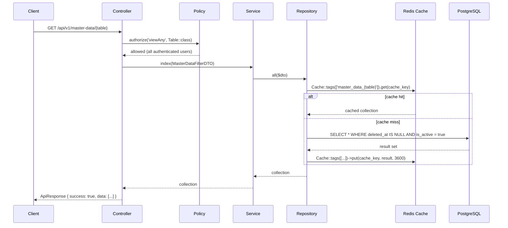
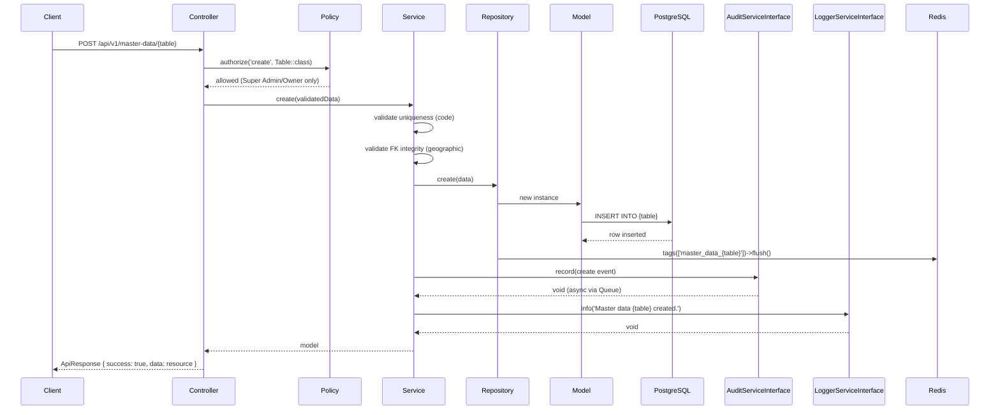
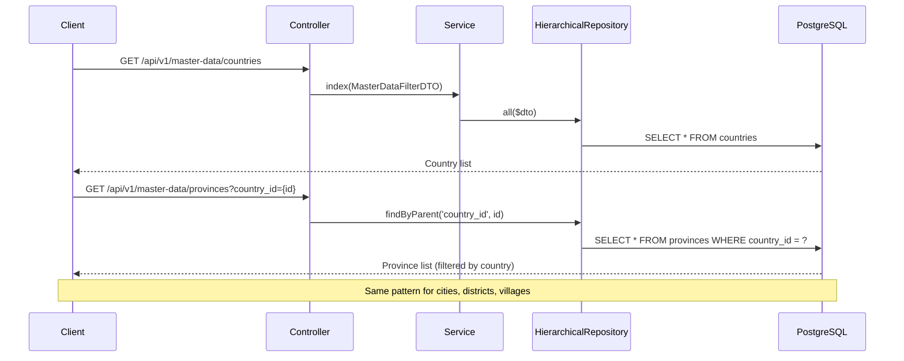
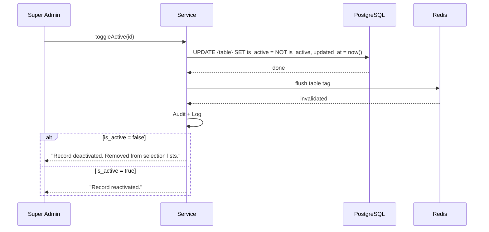
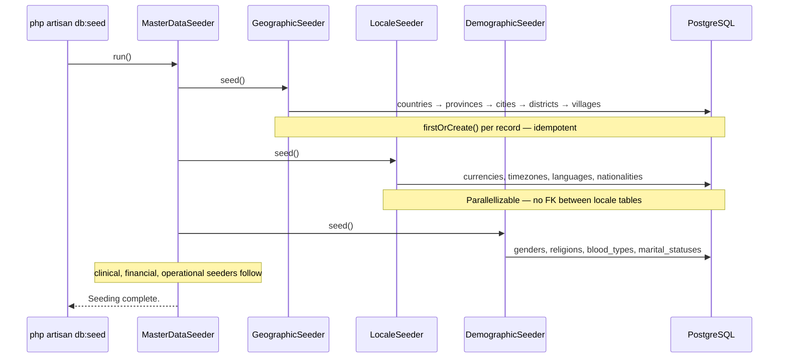

# Phase 09 — Master Data Flow

**Date:** 2026-08-09
**Phase:** 09 — Master Data
**SDLC Stage:** Design — Flow (Supporting Artifact)
**Status:** `STEP_09_06_MASTER_DATA_FLOW_DRAFT`

**Traceability:**
- Requirements: `docs/MasterData/Requirement.md` (STEP_09_03_PASS)
- Business Rules: `docs/MasterData/BusinessRule.md` (STEP_09_05_PASS)
- Platform: Phase 07 Platform Services (committed)
- Auth: Phase 08 Authentication (frozen)

---

## 1. Architecture Overview

### 1.1 Master Data Layer Position

```text
┌─────────────────────────────────────────────────────────┐
│                    HTTP Request                          │
│          /api/v1/master-data/{table}                     │
├─────────────────────────────────────────────────────────┤
│              Master Data Controllers                      │
│         (one per group, e.g., GeographicController)       │
│                                                           │
│  Authorization: Policy (read = any, write = Super Amin)   │
├─────────────────────────────────────────────────────────┤
│              Master Data Services                         │
│         extend BaseMasterDataService                      │
│                                                           │
│  Business rules: BR-X-001 through BR-X-011                │
│  Validation: code uniqueness, FK integrity, is_active     │
├─────────────────────────────────────────────────────────┤
│            Master Data Repositories                       │
│         extend BaseMasterDataRepository                   │
│                                                           │
│  Scopes: orderByName(), active(), inactive()              │
│  Caching: Redis — per-table tag                           │
├─────────────────────────────────────────────────────────┤
│         Master Data Models (Eloquent)                     │
│         extend BaseMasterDataModel                        │
│                                                           │
│  Traits: HasUuid, HasAudit, SoftDeletes                   │
├───────────────────┬───────────────────────────────────────┤
│                   │                                        │
│  PostgreSQL       │  Phase 07 Platform Services            │
│  23 tables        │  ┌──────────┐ ┌──────────┐           │
│                   │  │  Audit   │ │ Logging  │           │
│                   │  └──────────┘ └──────────┘           │
│                   │                                        │
│  Redis (cache)    │  Phase 08 Authentication               │
│                   │  Permissions: master_data.*            │
└───────────────────┴───────────────────────────────────────┘
```

### 1.2 Universal Master Data Pattern

All 23 tables follow this identical flow pattern:

```text
HTTP Request → Controller → Policy check → FormRequest → DTO
    → Service → [business rules] → Repository → [cache check/write]
    → Model (BaseMasterDataModel → Eloquent) → PostgreSQL
    → Audit Platform (create/update/delete events)
    → Logging Platform (operational logging)
    → ApiResponse envelope → HTTP Response
```

**No per-table flow variation.** The base architecture guarantees uniformity.

---

## 2. Read Flow (All Tables)

### 2.1 List / Index



**Authorization:** All authenticated users (`MASTER-BR-X-008`).
**Cache:** Redis per-table tags, 1-hour TTL (`MASTER-BR-X-009`).
**Filter:** `is_active = true` by default; `include_inactive` query param for admins (`MASTER-BR-X-004`).

### 2.2 Show / Detail

```text
Client → GET /api/v1/master-data/{table}/{id}
    → Policy: view → all authenticated
    → Service: find($id)
    → Repository: find($id) [with cache check]
    → ApiResponse { data: resource }
```

### 2.3 Caching Strategy

```text
Read operation:
    ↓
Repository checks Redis cache (tag: master_data_{table})
    ├─ Hit  → return cached collection/resource
    └─ Miss → query PostgreSQL → populate cache (TTL: 3600s) → return

Write operation (create/update/delete):
    ↓
After persistence:
    └─ Cache::tags(['master_data_{table}'])->flush()
       Invalidate entire table cache tag
```

---

## 3. Write Flow (Create / Update / Delete)

### 3.1 Create



### 3.2 Update

```text
Client → PUT /api/v1/master-data/{table}/{id}
    → Policy: update → Super Admin/Owner
    → Service: validate (code uniqueness excluding self, FK integrity)
    → Repository: update(id, data)
    → Model: UPDATE {table} SET ... WHERE id = ?
    → Cache: flush table tag
    → Audit: record(update event) — old_value, new_value
    → Log: info
    → ApiResponse { data: updated resource }
```

### 3.3 Delete (Soft)

```text
Client → DELETE /api/v1/master-data/{table}/{id}
    → Policy: delete → Super Admin/Owner
    → Service: validate (no child references — geographic RESTRICT)
    → Repository: softDelete(id)
    → Model: UPDATE deleted_at = now(), deleted_by = actor_id
    → Cache: flush table tag
    → Audit: record(delete event)
    → Log: info
    → ApiResponse { success: true, message: 'Deleted.' }
```

**Note:** Delete is always soft (`MASTER-BR-X-003`). Hard delete is never exposed. Physical records remain for referential integrity.

---

## 4. Geographic Hierarchy Flow

### 4.1 Cascading Dropdown



**Key Pattern:** Geographic tables implement `HierarchicalRepositoryInterface` with `findByParent()`. The `country_id` → `province_id` → `city_id` → `district_id` FK chain enables cascading dropdowns.

### 4.2 FK Constraint Enforcement (Create/Update)

```text
Create province:
    → Service validates country_id exists in countries table
    → If country_id is invalid → 422: "Parent country not found."
    → If country_id is valid → proceed with creation

Delete country:
    → Service checks: SELECT COUNT(*) FROM provinces WHERE country_id = ?
    → If count > 0 → 409: "Cannot delete — referenced by N provinces."
    → If count = 0 → proceed with soft delete
```

**Enforcement:** Database-level RESTRICT. Application-level pre-check for user-friendly messages (`MASTER-BR-GEO-002`).

---

## 5. Active / Inactive Lifecycle Flow



**Rule:** `is_active = false` records are excluded from dropdown endpoints by default (`MASTER-BR-X-004`). Toggle is reversible. No cascading — deactivating a country does NOT deactivate its provinces.

---

## 6. Seeding Flow



**Idempotency:** All seeders use `firstOrCreate(['code' => ...])` with fallback defaults (`MASTER-BR-X-006`). Running the seeder twice produces 0 duplicate records.

**Ordering:** Geographic order is mandatory. All other groups can be seeded in parallel.

---

## 7. Cross-Cutting Patterns

### 7.1 Authorization Flow

```text
Every endpoint:
    ↓
Policy::authorize(action, resource)
    ├─ Read    → Auth::check() → all authenticated users
    └─ Write   → Auth::user()->hasRole(['Super Admin', 'Owner'])
    ↓
Access granted → proceed to Service
Access denied  → 403 Forbidden
```

### 7.2 Audit Trail Flow

```text
Every write operation (create/update/delete):
    ↓
Service → AuditServiceInterface::record(AuditEntryDTO)
    ├─ action: create → old_value: {}, new_value: {fields}
    ├─ action: update → old_value: {before}, new_value: {after}
    └─ action: delete → old_value: {before}, new_value: {}
    ↓
AuditService → Queue → AuditLogJob → audit_logs (immutable)
```

**Note:** `organization_id` and `branch_id` are NULL on Master Data audit records (global scope, no tenant — `MASTER-BR-X-002`).

### 7.3 Logging Flow

```text
Every operation:
    ↓
Service → LoggerServiceInterface::info/error(message, context)
    ├─ context → ['table' => $table, 'actor_id' => Auth::id(), 'code' => $code]
    └─ Level: info for normal ops, error for failures
    ↓
LoggerService → file + DB (warning+)
```

### 7.4 Transaction Boundaries

```text
Create / Update:
    └─ DB::transaction(function () {
           Model::create() / update()
           // Cache flush & audit are OUTSIDE transaction
       })
       └─ Cache::flush()
       └─ Audit::record()

Delete (soft):
    └─ DB::transaction(function () {
           // FK pre-check
           Model::update(['deleted_at' => now(), 'deleted_by' => actor_id])
       })
       └─ Cache::flush()
       └─ Audit::record()

Read:
    └─ No transaction needed (read-only)
```

---

## 8. Error Handling

| Scenario | HTTP Status | Business Rule |
|---|---|---|
| Duplicate `code` | `422` | `MASTER-BR-X-005` |
| Invalid parent FK (geographic) | `422` | `MASTER-BR-GEO-002` |
| Delete prevented (children exist) | `409` | `MASTER-BR-GEO-002` |
| Unauthorized write | `403` | `MASTER-BR-X-008` |
| Unauthenticated | `401` | `MASTER-BR-X-008` |
| Record not found | `404` | Standard |
| Validation failure | `422` | Standard |

All error responses use `ApiResponse` envelope: `{ success: false, message: "...", errors: {...} }`.

---

## 9. Flow Summary

| # | Flow | Description | Primary Rules |
|---|---|---|---|
| 1 | **Read (List)** | GET → Policy → Service → Repository → Cache → DB → ApiResponse | `BR-X-004`, `BR-X-008`, `BR-X-009` |
| 2 | **Read (Detail)** | GET/{id} → Policy → Service → Repository → Cache → DB → ApiResponse | `BR-X-008`, `BR-X-009` |
| 3 | **Create** | POST → Policy → Service → validate → Repository → INSERT → cache flush → audit → log | `BR-X-005`, `BR-X-007`, `BR-X-008`, `BR-X-010` |
| 4 | **Update** | PUT/{id} → Policy → Service → validate → Repository → UPDATE → cache flush → audit → log | `BR-X-005`, `BR-X-007`, `BR-X-008`, `BR-X-010` |
| 5 | **Delete (Soft)** | DELETE/{id} → Policy → Service → FK check → Repository → soft delete → cache flush → audit → log | `BR-X-003`, `BR-X-007`, `BR-X-008`, `BR-GEO-002` |
| 6 | **Activate/Deactivate** | PATCH/{id}/toggle → Policy → UPDATE is_active → cache flush → audit | `BR-X-004` |
| 7 | **Geographic Hierarchy** | GET cascade → HierarchicalRepository::findByParent() → FK pre-validation | `BR-GEO-002`, `BR-GEO-003` |
| 8 | **Seeding** | CLI → MasterDataSeeder → group seeders → firstOrCreate() → idempotent | `BR-X-006`, `BR-DEM-002` |

---

## 10. Traceability Matrix

| Flow | Requirement IDs | Business Rule IDs | Dependencies |
|---|---|---|---|
| Read (List) | `X-001`, `X-002`, `X-004` | `BR-X-004`, `BR-X-008`, `BR-X-009` | Auth (permission), Redis |
| Read (Detail) | `X-001`, `X-002`, `X-004` | `BR-X-004`, `BR-X-008`, `BR-X-009` | Auth, Redis |
| Create | `X-001`, `X-005` | `BR-X-005`, `BR-X-007`, `BR-X-008`, `BR-X-010` | Auth, Audit, Logging |
| Update | `X-001`, `X-005` | `BR-X-005`, `BR-X-007`, `BR-X-008`, `BR-X-010` | Auth, Audit, Logging |
| Delete (Soft) | `X-001`, `X-003`, `GEO-002` | `BR-X-003`, `BR-X-007`, `BR-X-008`, `BR-GEO-002` | Auth, Audit, Logging |
| Activate/Deactivate | `X-004` | `BR-X-004` | Auth |
| Geographic Hierarchy | `GEO-002`–`005` | `BR-GEO-002`, `BR-GEO-003` | — |
| Seeding | `X-006`, `DEM-002` | `BR-X-006`, `BR-DEM-002` | Seed data sources (ISO, BPS, MoHA) |

---

## 11. Drift Detection

### A. Requirement ↔ Flow
**PASS** — All 35 requirements have corresponding flow coverage. Module-specific requirements (GEO-001–005, LOC-001–004, etc.) are covered by the universal CRUD flow pattern.

### B. Business Rule ↔ Flow
**PASS** — All 32 business rules are represented in flows. Authorization (BR-X-008), audit (BR-X-007), caching (BR-X-009), FK integrity (BR-GEO-002), and soft delete (BR-X-003) are each explicitly shown in their respective flow diagrams.

### C. Flow ↔ Architecture
**PASS** — Controller → Service → Repository → Model layer sequence maintained. No direct Eloquent in controllers. All service methods follow Platform-first dependency direction.

### D. Flow ↔ Platform Services
**PASS** — `AuditServiceInterface` and `LoggerServiceInterface` used as contracts. No direct `AuditLog` model or `Log` facade bypass.

### E. Flow ↔ Authentication Boundary
**PASS** — Authentication referenced only through Spatie permissions and `Auth::id()`. No Authentication domain classes imported in flow design.

### F. Cross-Module Dependency
**PASS** — Geographic dependency chain (country → province → city → district → village) documented. All other 18 tables are independent.

### G. Tenant/Organization/Branch Isolation
**PASS** — Master Data is global scope (`MASTER-BR-X-002`). No tenant filtering in repository queries. Audit records carry NULL `organization_id`.

### H. Transaction Boundary
**PASS** — Write operations use `DB::transaction()` around persistence only. Audit and cache flush are outside the transaction.

### I. Audit Coverage
**PASS** — All write operations (create, update, delete) trigger `AuditServiceInterface::record()`. Read operations do not audit.

### J. Logging Coverage
**PASS** — `LoggerServiceInterface::info()` for normal operations, `::error()` for failures.

### K. Error Handling
**PASS** — 7 error scenarios documented with HTTP status codes and business rule references.

### L. Missing Flow Coverage
**0 missing.** All cross-cutting and module-level coverage complete.

### M. Invented Behavior
**0 invented.** All flows derive from requirements and business rules.

---

## Governance Record

| Check | Result |
|---|---|
| All 35 requirements have flow coverage | ✅ |
| All 32 business rules have flow coverage | ✅ |
| 0 CRITICAL/HIGH drift | ✅ |
| 0 invented behavior | ✅ |
| Authorization boundary clear (read/write) | ✅ |
| Tenant boundary clear (global) | ✅ |
| Audit/Logging dependency via Platform contracts | ✅ |
| Authentication dependency via frozen contract | ✅ |
| Traceability complete (§10) | ✅ |
| Frozen artifacts unchanged | ✅ |

STEP_09_06_MASTER_DATA_FLOW_DRAFT_PASS
