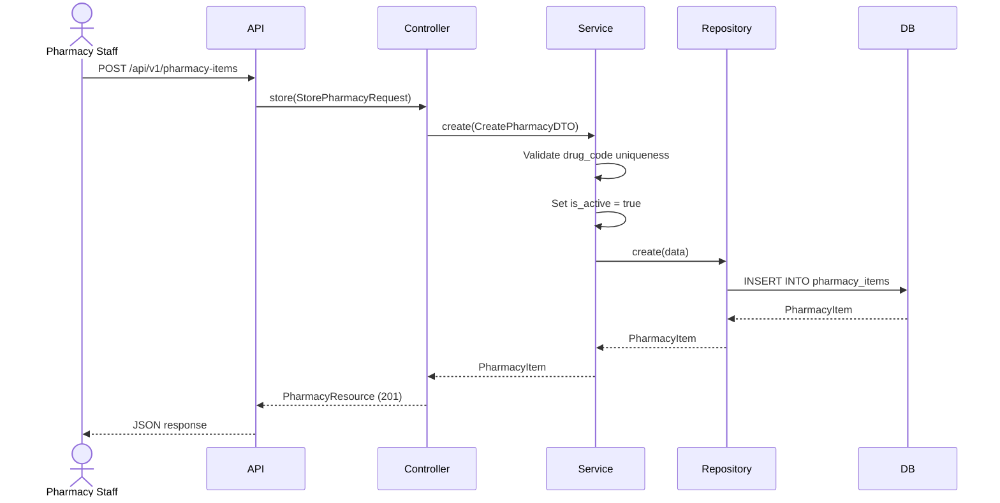
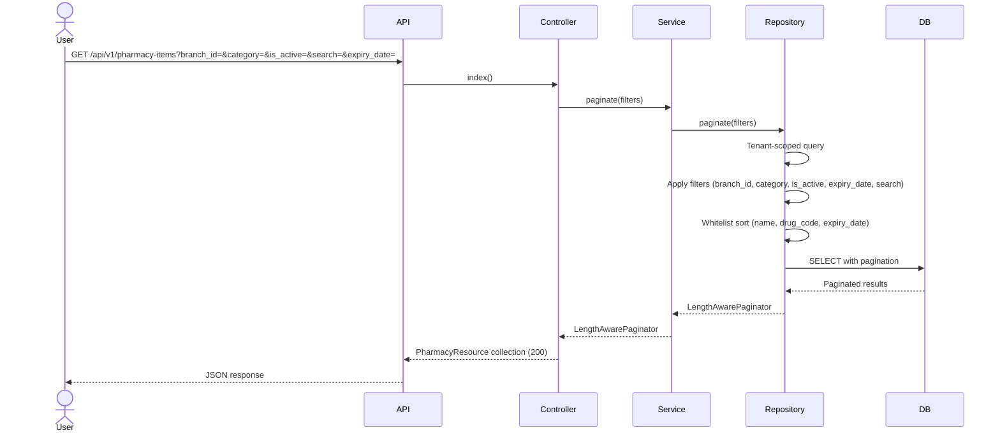
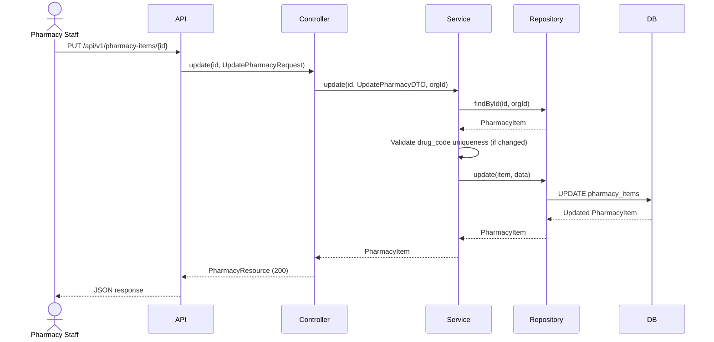
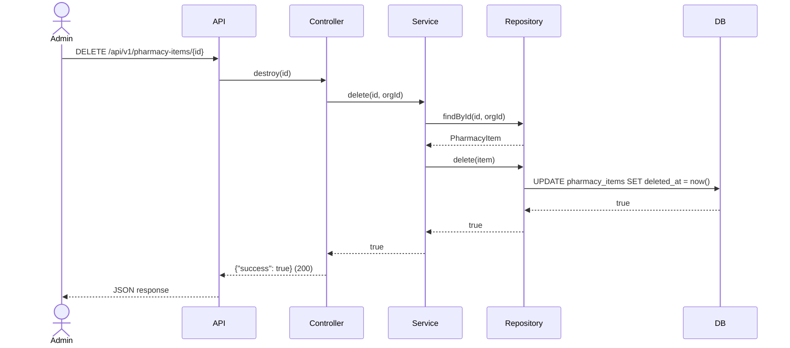
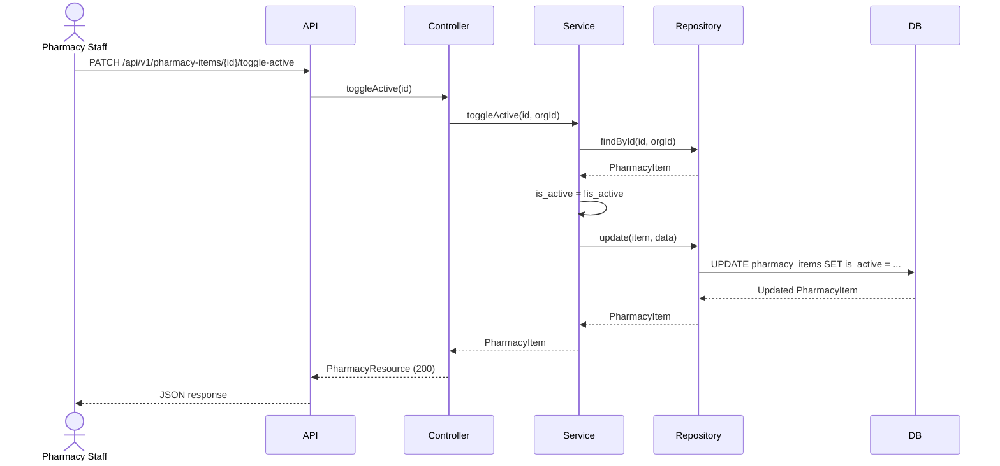

# Phase 19 — Pharmacy Flow

**Date:** 2026-08-17 | **Phase:** 19 — Pharmacy | **Status:** STEP_19_03_DRAFT

## Flows

### 1. Create Pharmacy Item

### 2. List Pharmacy Items

### 3. Update Pharmacy Item

### 4. Delete Pharmacy Item

### 5. Toggle Active Status

### Traceability

| Flow | Requirement | Business Rule |
|---|---|---|
| Create | PHARM-REQ-001, PHARM-REQ-002, PHARM-REQ-004, PHARM-REQ-005, PHARM-REQ-017 | BR-PHARM-001, BR-PHARM-003, BR-PHARM-004, BR-PHARM-010, BR-PHARM-019 |
| List | PHARM-REQ-013, PHARM-REQ-014, PHARM-REQ-015, PHARM-REQ-016 | BR-PHARM-012, BR-PHARM-013 |
| Update | PHARM-REQ-018 | BR-PHARM-003, BR-PHARM-006, BR-PHARM-008, BR-PHARM-009, BR-PHARM-020 |
| Delete | PHARM-REQ-019 | BR-PHARM-014 |
| Toggle Active | PHARM-REQ-020 | BR-PHARM-011 |