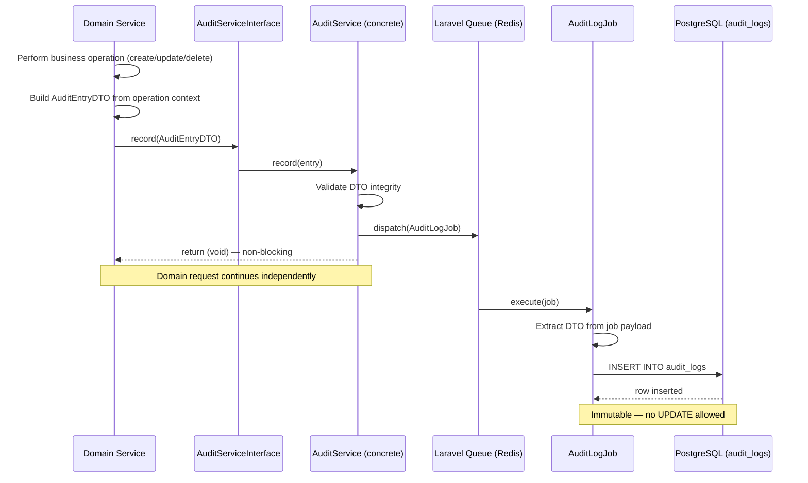
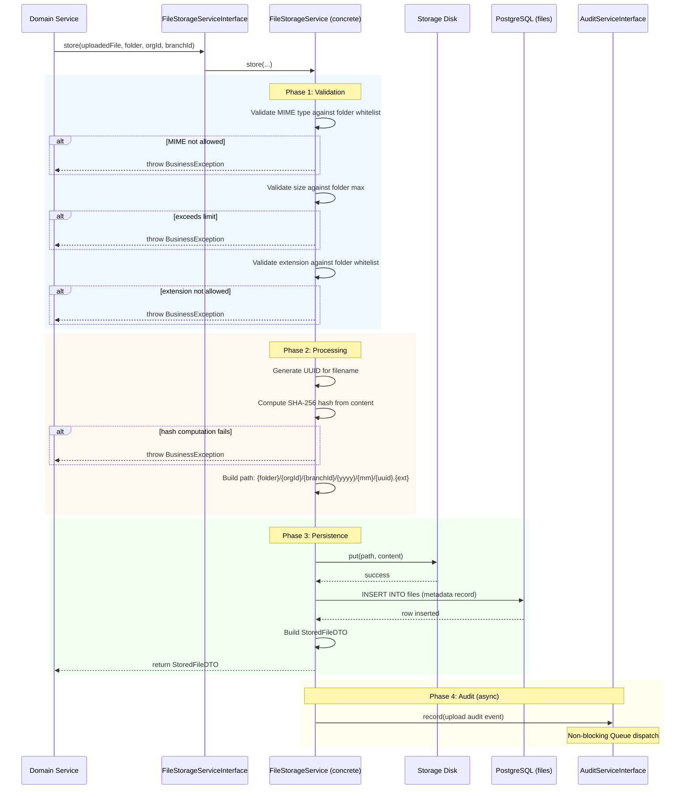
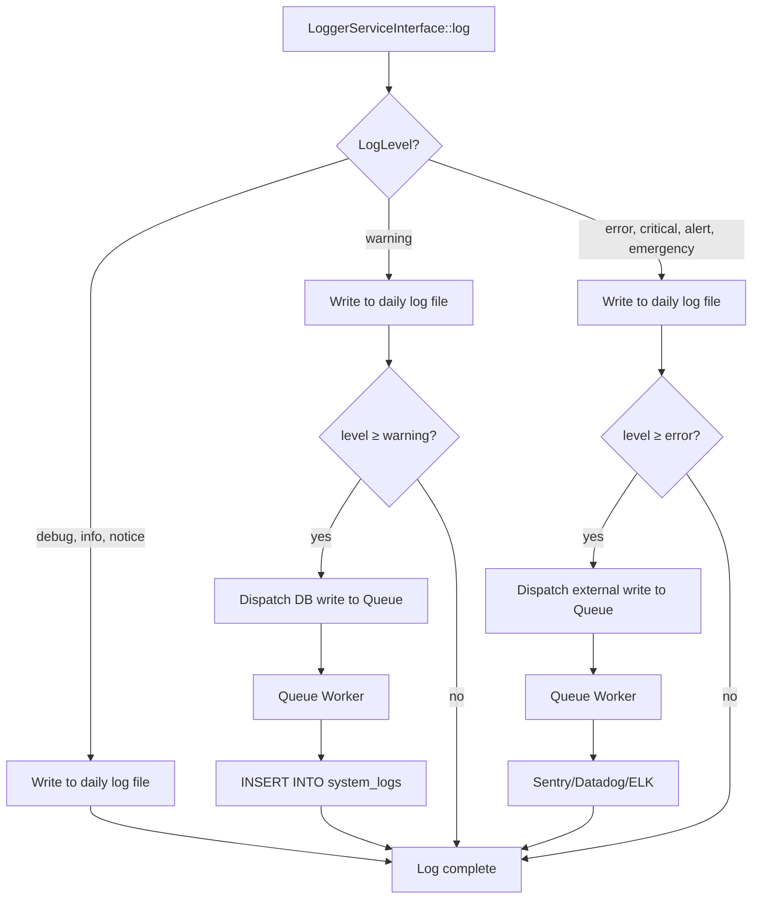
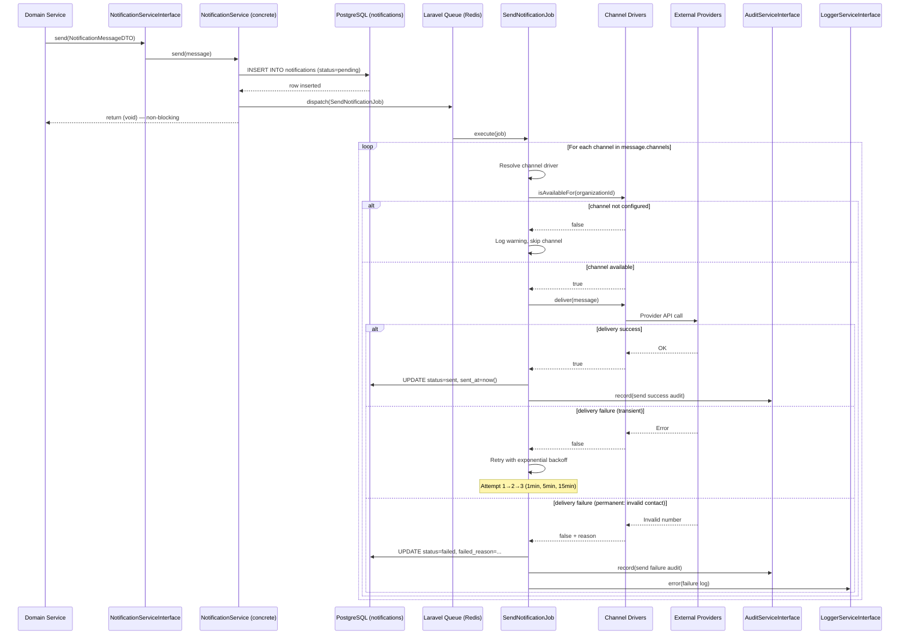
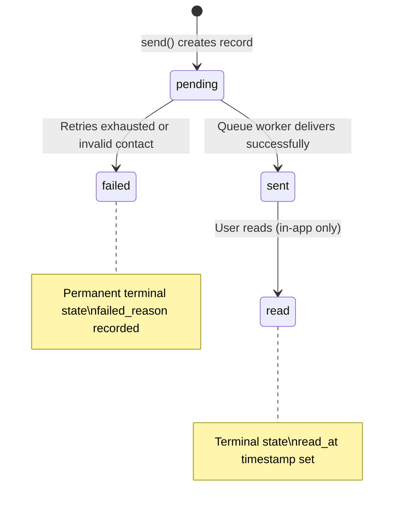
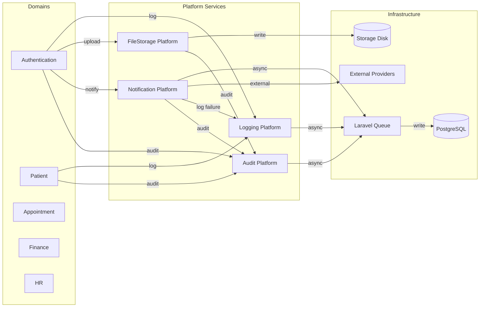

# Phase 07 — Platform Services Flow

**Date:** 2026-08-09
**Phase:** 07 — Platform Services
**SDLC Stage:** Design — Flow (Supporting Artifact)
**Status:** `STEP_07_07_PLATFORM_SERVICES_FLOW_DRAFT`

**Traceability:**
- Requirement: `docs/Platform/Requirement.md` (STEP_07_03_PASS)
- Business Rules: `docs/Platform/BusinessRule.md` (STEP_07_04_DRAFT)
- Design Docs: `AuditPlatform.md`, `FileStorage.md`, `LoggingPlatform.md`, `NotificationPlatform.md`
- Contracts: `app/Platform/*/Contracts/`, `app/Platform/*/DTO/`, `app/Platform/*/Enums/`

---

## 1. Architecture Overview

### 1.1 Platform Layer Position

```text
┌─────────────────────────────────────────────────────────┐
│                    HTTP Request                          │
│  public/index.php → Controller → FormRequest → DTO       │
├─────────────────────────────────────────────────────────┤
│              Domain Layer (app/Domains/)                  │
│                                                          │
│  Patient │ Appointment │ Finance │ HR │ Authentication   │
│                                                          │
│  Each domain: Service → Repository → Model               │
│                       │                                  │
│          depends on   ▼  (interfaces only)               │
├─────────────────────────────────────────────────────────┤
│           Platform Layer (app/Platform/)                  │
│                                                          │
│  ┌──────────┐ ┌────────────┐ ┌──────────┐ ┌───────────┐│
│  │  Audit   │ │ FileStorage │ │ Logging  │ │ Notif.    ││
│  │ Platform │ │ Platform    │ │ Platform │ │ Platform  ││
│  └────┬─────┘ └──────┬──────┘ └────┬─────┘ └─────┬─────┘│
│       │              │             │              │      │
├───────┼──────────────┼─────────────┼──────────────┼──────┤
│       ▼              ▼             ▼              ▼      │
│               Laravel Queue (Redis)                       │
│                    ┌──────┐                               │
│                    │ Jobs │                               │
│                    └──┬───┘                               │
├───────────────────────┼───────────────────────────────────┤
│                       ▼                                    │
│              PostgreSQL Database                           │
│  audit_logs │ files │ system_logs │ notifications          │
├───────────────────────────────────────────────────────────┤
│                     Storage                                │
│         Local Disk (dev) / S3-Compatible (prod)            │
├───────────────────────────────────────────────────────────┤
│                External Systems                            │
│     SMTP │ WhatsApp API │ FCM │ Sentry/Datadog             │
└───────────────────────────────────────────────────────────┘
```

### 1.2 Layer Communication Rules

| From | To | Via | Rule |
|---|---|---|---|
| Domain Service | Platform Service | Interface injection | Depend only on `*ServiceInterface` |
| Domain Service | Database | NEVER | No direct queries from domain |
| Platform Service | Platform Service | Interface injection | Cross-platform allowed (e.g. FileStorage → Audit) |
| Platform Service | Queue | Job dispatch | All I/O-bound operations async |
| Queue Job | Database | Eloquent Model | Only platform-owned models |
| Platform Service | External Provider | Channel Driver | Only through platform abstraction |

---

## 2. Audit Platform — Flow

### 2.1 Audit Recording Sequence



### 2.2 Audit Action Classification

```text
                    ┌─────────────────────────────┐
                    │       AuditAction Enum       │
                    └────────────┬────────────────┘
                                 │
              ┌──────────────────┼──────────────────┐
              │                                     │
    mutation    isMutation() = true          isMutation() = false
              │                                     │
    ┌─────────┼─────────┐              ┌────────────┼────────────┐
    │         │         │              │            │            │
  Create   Update   Delete  Restore  Login  Logout  Export  Import  Print  Sync  Integration
    │         │         │              │            │            │
    ▼         ▼         ▼              ▼            ▼            ▼
 old=null  old+new  new=null    old+new   no auditable   no auditable  no diff
 new=data  populated             data     type/id        type/id
```

### 2.3 Audit Entry Construction Flow

```text
Domain Service (e.g. OrganizationService::update())
    │
    ├─ 1. Begin DB transaction
    ├─ 2. Load current state → $oldData
    ├─ 3. Apply changes
    ├─ 4. Build AuditEntryDTO:
    │      action      = AuditAction::Update
    │      module      = 'organization'
    │      userId      = Auth::id()
    │      orgId       = current organization
    │      branchId    = current branch
    │      auditableType = Organization::class
    │      auditableId = $org->id
    │      oldValue    = $oldData (filtered — no secrets)
    │      newValue    = $org->fresh()->toArray() (filtered)
    │      ipAddress   = request()->ip()
    │      userAgent   = request()->userAgent()
    │      device      = detected from userAgent
    │
    ├─ 5. Commit transaction
    └─ 6. Call AuditServiceInterface::record($dto)
         └─ Queue → AuditLogJob → audit_logs
```

### 2.4 Session Events (Login/Logout) — Special Path

```text
AuthService::login()
    │
    ├─ Validate credentials
    ├─ Issue Sanctum token
    └─ Call AuditServiceInterface::log(
           action:       AuditAction::Login,
           module:       'auth',
           auditableType: null,     // ← no model context
           auditableId:   null,     // ← no model context
           oldValue:      [],
           newValue:      []
       )
         └─ Queue → AuditLogJob → audit_logs
              auditable_type = NULL
              auditable_id   = NULL
```

---

## 3. FileStorage Platform — Flow

### 3.1 File Upload Flow



### 3.2 File Access Flow (Signed URL)

```text
Domain Service
    │
    ├─ Call FileStorageServiceInterface::temporaryUrl($path, $expiresIn)
    │
    ▼
FileStorageService
    │
    ├─ Determine active disk (local vs S3 from config)
    │
    ├─ Local driver:
    │     └─ Generate Laravel signed route URL with expiry
    │
    ├─ S3 driver:
    │     └─ Generate S3 presigned URL with expiry
    │
    └─ Return signed URL string

Default expiry: 900 seconds (15 minutes)
Expired URL behavior: HTTP 403 or 404
```

### 3.3 File Delete Flow (Soft Delete)

```text
Domain Service
    │
    ├─ Call FileStorageServiceInterface::delete($path)   [NOT exposed to domain]
    │   or
    ├─ Domain calls its own soft-delete (sets deleted_at on fileable record)
    │
    ▼
File Storage Platform
    │
    ├─ Mark files record: deleted_at = now()
    ├─ Physical file RETAINED on disk
    ├─ Record delete event via AuditServiceInterface
    │
    └─ Physical deletion deferred to background retention process
         (post-Phase 07 — retention policy job)
```

---

## 4. Logging Platform — Flow

### 4.1 Log Routing Flow



### 4.2 Log Entry Lifecycle

```text
HTTP Middleware
    │
    ├─ Generate request_id (UUID)
    ├─ Store in request context
    │
    ▼
Domain/Platform Service
    │
    ├─ Catch exception or log operation
    │
    ├─ Call LoggerServiceInterface::error(
    │      message: "[PatientService::create] Failed to create patient.",
    │      context: [
    │          'organization_id' => $orgId,
    │          'branch_id'       => $branchId,
    │          'request_id'      => request_id(),
    │          'exception'       => $e::class,
    │          // Secret fields EXCLUDED by caller
    │      ]
    │   )
    │
    ▼
LoggerService (concrete)
    │
    ├─ 1. Synchronous: Write to daily log file (always)
    │      storage/logs/laravel-YYYY-MM-DD.log
    │
    ├─ 2. Async: If shouldPersist(level) → Queue → system_logs table
    │      └─ Warning, Error, Critical, Alert, Emergency
    │
    └─ 3. Async: If shouldForwardExternal(level) → Queue → External monitor
           └─ Error, Critical, Alert, Emergency
```

### 4.3 Production Suppression of Debug

```text
APP_ENV=production
    │
    ├─ LoggerServiceInterface::debug() called
    │
    ▼
LoggerService (concrete)
    │
    ├─ Check: APP_ENV === 'production'
    ├─ Yes → silently return (no write)
    └─ No  → write to daily log file
```

---

## 5. Notification Platform — Flow

### 5.1 Notification Dispatch Flow



### 5.2 Notification Status State Machine



### 5.3 Channel Resolution Flow

```text
SendNotificationJob receives: NotificationMessageDTO
    channels: [WhatsApp, Email, SMS, Push]

Loop over channels:
    │
    ├─ WhatsApp
    │   ├─ Resolve WhatsAppChannel driver
    │   ├─ Call isAvailableFor(organizationId)
    │   │   └─ Check: org has WhatsApp Business API credentials?
    │   │       No → Skip. Log warning. Continue to next channel.
    │   │       Yes → Continue.
    │   ├─ Call deliver(message)
    │   │   └─ Route through IntegrationHub
    │   │       └─ WhatsApp Business API
    │   └─ On success → mark sent; on failure → retry or fail
    │
    ├─ Email
    │   ├─ Resolve EmailChannel driver
    │   ├─ Call isAvailableFor(organizationId)
    │   │   └─ Check: SMTP/Mailgun/SES configured?
    │   ├─ Call deliver(message)
    │   │   └─ Direct SMTP send (or via configured mail driver)
    │   └─ On success → mark sent; on failure → retry or fail
    │
    ├─ SMS
    │   ├─ Resolve SmsChannel driver
    │   ├─ Call isAvailableFor(organizationId)
    │   ├─ Call deliver(message)
    │   │   └─ Route through IntegrationHub → Twilio/Vonage
    │   └─ On success → mark sent; on failure → retry or fail
    │
    └─ Push
        ├─ Resolve PushChannel driver
        ├─ Call isAvailableFor(organizationId)
        ├─ Call deliver(message)
        │   └─ Route through IntegrationHub → Firebase FCM
        └─ On success → mark sent; on failure → retry or fail
```

### 5.4 In-App Read Lifecycle

```text
User reads notification in-app
    │
    ▼
Domain Controller → NotificationServiceInterface::markAsRead($notificationId)
    │
    ▼
NotificationService (concrete)
    │
    ├─ Load notification by ID
    ├─ Verify: channel === 'in_app'
    ├─ Verify: notification belongs to user's organization
    │   (cross-org read denied)
    ├─ Set: read_at = now()
    ├─ Set: status = 'read'
    ├─ Save
    └─ Return true (or false if not found)
```

---

## 6. Inter-Platform Flows

### 6.1 FileStorage → Audit

```text
FileStorageService::store()
    │
    ├─ ... validation, hash, disk write, DB insert ...
    │
    └─ After successful store:
         │
         └─ AuditServiceInterface::log(
                action:       AuditAction::Create,
                module:       'filestorage',
                auditableType: File::class,
                auditableId:   $storedFile->id,
                oldValue:      [],
                newValue:      ['path' => $path, 'folder' => $folder->value, ...]
            )
              └─ Queue → AuditLogJob → audit_logs
```

### 6.2 Notification → Audit + Logging

```text
SendNotificationJob::handle()
    │
    ├─ On delivery success:
    │     └─ AuditServiceInterface::log(
    │            action:       AuditAction::Create,   // "notification sent"
    │            module:       'notification',
    │            auditableType: Notification::class,
    │            auditableId:   $notification->id,
    │            newValue:      ['channel' => $channel->value, 'status' => 'sent']
    │        )
    │
    └─ On delivery failure:
          ├─ AuditServiceInterface::log(
          │      action:       AuditAction::Update,
          │      module:       'notification',
          │      auditableType: Notification::class,
          │      auditableId:   $notification->id,
          │      oldValue:      ['status' => 'pending'],
          │      newValue:      ['status' => 'failed', 'reason' => $reason]
          │  )
          │
          └─ LoggerServiceInterface::error(
                 message: "[NotificationService::send] Delivery failed.",
                 context: [
                     'notification_id' => $notification->id,
                     'channel'         => $channel->value,
                     'reason'          => $reason,
                     'organization_id' => $orgId,
                 ]
             )
```

### 6.3 Cross-Platform Dependency Graph



---

## 7. Cross-Cutting Patterns

### 7.1 Queue-Based Async Pattern

```text
Rule: ANY Platform Service operation involving I/O latency MUST use Queue.

Pattern:
    Interface method → return void
    Concrete method  → dispatch job to Queue → return immediately
    Queue job        → perform actual I/O → update status

Services using this pattern:
    Audit:        record() → AuditLogJob          → audit_logs INSERT
    Logging:      log()    → DatabaseLogJob        → system_logs INSERT (warning+)
                  log()    → ExternalLogJob         → Sentry/Datadog (error+)
    Notification: send()   → SendNotificationJob    → Channel delivery

Exceptions (synchronous):
    Logging daily file writes (local filesystem — fast)
    FileStorage store() (need validation result + DTO return)
```

### 7.2 Failure Isolation Pattern

```text
Rule: Platform Service failures MUST NOT propagate to domain transaction.

┌─────────────────────────────────────────────────────┐
│  Domain Service                                      │
│                                                      │
│  try {                                               │
│      DB::transaction(function () {                   │
│          $repo->update($dto);    // domain operation  │
│      });                                             │
│                                                      │
│      // Audit is OUTSIDE the transaction             │
│      $this->audit->record($auditEntry);              │
│                                                      │
│  } catch (DomainException $e) {                      │
│      throw $e;   // domain failures propagate        │
│  }                                                   │
│  // Platform failures are silently absorbed           │
│  // AuditServiceInterface::record() never throws      │
└─────────────────────────────────────────────────────┘

Inside Platform Service:
    try {
        Queue::push($job);
    } catch (Throwable $e) {
        // Log the Queue failure, do NOT rethrow
        Log::error('Audit dispatch failed', ['exception' => $e]);
        // Domain operation succeeded — audit loss is logged but not escalatd
    }
```

### 7.3 Tenant Boundary Enforcement

```text
Every persisted Platform record must carry:
    ┌──────────────────────────────────────────────┐
    │  organization_id  (UUID, non-nullable)        │
    │  branch_id         (UUID, nullable)            │
    └──────────────────────────────────────────────┘

Source of tenant context:
    ┌──────────────────────────────────────────────┐
    │  Authenticated request: Auth::user()          │
    │      → organization_id from user context      │
    │      → branch_id from current session/scope   │
    │                                               │
    │  Queue job (no request):                      │
    │      → tenant context MUST be embedded in     │
    │        job payload (carried from caller)      │
    │                                               │
    │  Non-authenticated context (e.g. cron):       │
    │      → system_logs may have null tenant       │
    └──────────────────────────────────────────────┘
```

### 7.4 Interface-Driven Architecture

```text
Every domain → Platform Service interaction:

┌────────────────────────────────────────────────────┐
│  Domain Service (Constructor Injection)             │
│                                                     │
│  public function __construct(                       │
│      private AuditServiceInterface $audit,          │
│      private FileStorageServiceInterface $storage,  │
│      private LoggerServiceInterface $logger,        │
│      private NotificationServiceInterface $notify,  │
│  ) {}                                               │
└────────────────────────────────────────────────────┘
                    │
                    │  Resolved by Laravel Service Container
                    ▼
┌────────────────────────────────────────────────────┐
│  Platform ServiceProvider                          │
│                                                     │
│  $this->app->bind(                                  │
│      AuditServiceInterface::class,                  │
│      AuditService::class                            │
│  );                                                 │
│                                                     │
│  $this->app->bind(                                  │
│      FileStorageServiceInterface::class,            │
│      FileStorageService::class                      │
│  );                                                 │
│  // ... same pattern for all 4 services              │
└────────────────────────────────────────────────────┘

Domains NEVER import:
    ✗ App\Platform\Audit\Services\AuditService
    ✗ App\Platform\Audit\Models\AuditLog
    ✗ App\Platform\Audit\Jobs\AuditLogJob
    ✗ Illuminate\Support\Facades\Log
    ✗ Illuminate\Support\Facades\Storage
```

### 7.5 Secret Exclusion Pattern

```text
Domain Service (caller responsibility):
    │
    ├─ Build data array for audit/logging
    │
    ├─ FILTER out Secret-classified fields:
    │     - password
    │     - password_hash (or password)
    │     - access_token
    │     - refresh_token
    │     - credit_card_number
    │     - any field classified as Secret per ExposureClassification
    │
    ├─ Pass filtered data to Platform interface
    │
    └─ Platform does NOT perform redaction — exclusion is caller's job.

    Rationale (BR-AUD-006):
    Auditing secrets creates irreversible exposure.
    Audit is immutable — leaked secrets in audit require purge that violates immutability.
    Exclusion-before-recording is the only safe path.
```

---

## 8. Flow Summary

| Flow | Description | Primary Rules |
|---|---|---|
| Audit Recording | Domain → DTO → Queue → audit_logs | BR-AUD-001 through AUD-010 |
| File Upload | Validate → UUID → Hash → Disk → DB → Audit | BR-FS-001 through FS-011 |
| File Access | signed URL (15min) or permission stream | BR-FS-007 |
| File Delete | soft delete → retention → physical purging | BR-FS-006 |
| Log Routing | Level → destination (file/DB/external) | BR-LOG-001 through LOG-011 |
| Notification Dispatch | Queue → Channel drivers → Providers | BR-NOT-001 through NOT-010 |
| Notification Retry | 3 attempts + exponential backoff | BR-NOT-002, NOT-008 |
| In-App Read | markAsRead() → read_at timestamp | BR-NOT-005 |
| Cross-Platform Audit | FS → Audit, Notif → Audit | BR-FS-011, BR-NOT-010 |
| Failure Isolation | Platform failures never propagate | BR-AUD-010, BR-X-003 |
| Tenant Scoping | All records carry org/branch | BR-AUD-008, BR-FS-003, BR-LOG-006, BR-NOT-003 |

---

## Governance Record

| Check | Result |
|---|---|
| All flows trace to PLATFORM-REQ-* requirements | Yes — see Requirement.md §2-6 |
| All flows align with PLATFORM-BR-* business rules | Yes — see BusinessRule.md §1-5 |
| All flows match existing contracts | Yes — interfaces, DTOs, enums consistent |
| No invented flows | Yes — derived from design docs only |
| No implementation artifacts created | Yes — design artifact only |
| Authentication boundary respected | Yes — Auth is consumer, not modified |
| No ADR/Decision modified | Yes |
| AGENTS.md not modified | Yes |
| Mermaid diagrams are SDLC-compliant | Yes |
