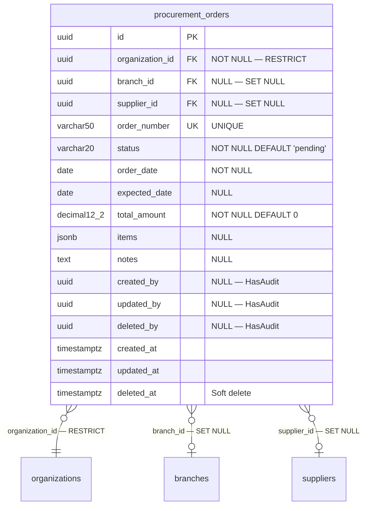

# Phase 21 — Procurement ERD

**Date:** 2026-08-17 | **Phase:** 21 — Procurement | **Status:** STEP_21_04_DRAFT

## 1. Entity — `procurement_orders`



## 2. Entity Specification

| # | Column | Type | Nullable | Default | Key | FK |
|---|---|---|---|---|---|---|
| 1 | `id` | `uuid` | NOT NULL | — | PK | — |
| 2 | `organization_id` | `uuid` | NOT NULL | — | — | → organizations.id RESTRICT |
| 3 | `branch_id` | `uuid` | NULL | — | — | → branches.id SET NULL |
| 4 | `supplier_id` | `uuid` | NULL | — | — | → suppliers.id SET NULL |
| 5 | `order_number` | `varchar(50)` | NOT NULL | — | UK | — |
| 6 | `status` | `varchar(20)` | NOT NULL | `pending` | — | — |
| 7 | `order_date` | `date` | NOT NULL | — | — | — |
| 8 | `expected_date` | `date` | NULL | — | — | — |
| 9 | `total_amount` | `decimal(12,2)` | NOT NULL | `0` | — | — |
| 10 | `items` | `jsonb` | NULL | — | — | — |
| 11 | `notes` | `text` | NULL | — | — | — |
| 12 | `created_by` | `uuid` | NULL | — | — | — |
| 13 | `updated_by` | `uuid` | NULL | — | — | — |
| 14 | `deleted_by` | `uuid` | NULL | — | — | — |
| 15 | `created_at` | `timestamptz` | NOT NULL | CURRENT_TIMESTAMP | — | — |
| 16 | `updated_at` | `timestamptz` | NULL | — | — | — |
| 17 | `deleted_at` | `timestamptz` | NULL | — | — | — |

**17 columns.**

## 3. Relationship Inventory

| # | Child | FK | Parent | Cardinality | ON DELETE | Optional? |
|---|---|---|---|---|---|---|
| 1 | `procurement_orders` | `organization_id` | `organizations` | N:1 | RESTRICT | No |
| 2 | `procurement_orders` | `branch_id` | `branches` | N:1 | SET NULL | Yes |
| 3 | `procurement_orders` | `supplier_id` | `suppliers` | N:1 | SET NULL | Yes |

**3 relationships. 0 CASCADE.**

## 4. Constraint & Index Inventory

| Entity | Constraint/Index | Columns | Type |
|---|---|---|---|
| `procurement_orders` | PK | `(id)` | PRIMARY KEY |
| `procurement_orders` | `procurement_orders_order_number_unique` | `(order_number)` | UNIQUE |
| `procurement_orders` | `procurement_orders_org_status_idx` | `(organization_id, status)` | Composite B-tree |
| `procurement_orders` | `procurement_orders_order_date_idx` | `(order_date)` | B-tree |

**4 indexes (1 PK + 1 UK + 2 composite/single).**

## 5. Model Guidance

```php
use App\Core\Base\BaseModel;

class Procurement extends BaseModel
{
    protected $table = 'procurement_orders';

    protected $casts = [
        'order_date'     => 'date',
        'expected_date'  => 'date',
        'total_amount'   => 'decimal:2',
        'items'          => 'array',
        'created_at'     => 'datetime',
        'updated_at'     => 'datetime',
        'deleted_at'     => 'datetime',
    ];
}
```

- Extends `BaseModel` (HasUuid, HasAudit, SoftDeletes, $guarded=[])