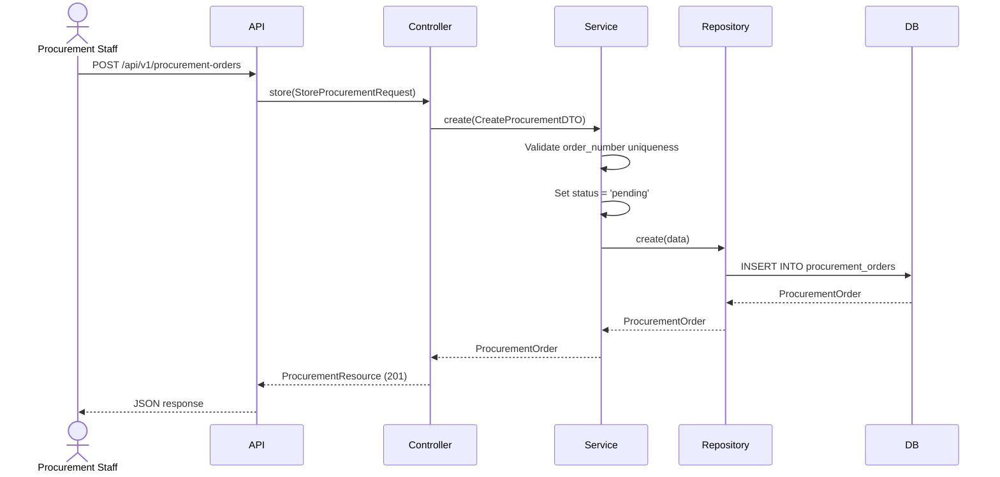
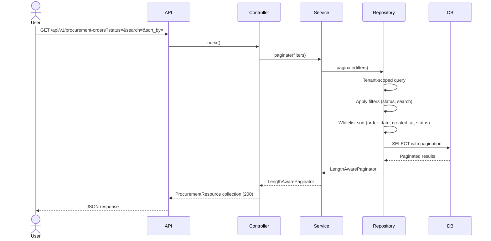
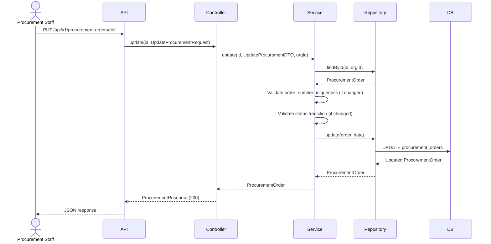
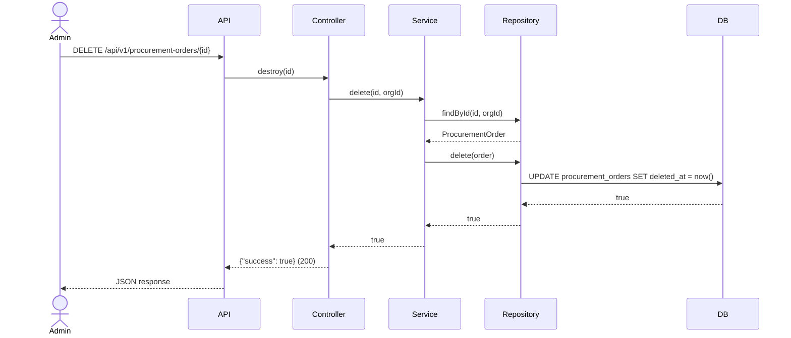

# Phase 21 — Procurement Flow

**Date:** 2026-08-17 | **Phase:** 21 — Procurement | **Status:** STEP_21_03_DRAFT

## Flows

### 1. Create Procurement Order

### 2. List Procurement Orders

### 3. Update Procurement Order

### 4. Delete Procurement Order

### Traceability

| Flow | Requirement | Business Rule |
|---|---|---|
| Create | PROC-REQ-001, PROC-REQ-002, PROC-REQ-005, PROC-REQ-007, PROC-REQ-016 | BR-PROC-001, BR-PROC-004, BR-PROC-005, BR-PROC-015 |
| List | PROC-REQ-012, PROC-REQ-013, PROC-REQ-014, PROC-REQ-015 | BR-PROC-008, BR-PROC-009 |
| Update | PROC-REQ-017 | BR-PROC-004, BR-PROC-016, BR-PROC-017 |
| Delete | PROC-REQ-018 | BR-PROC-010 |