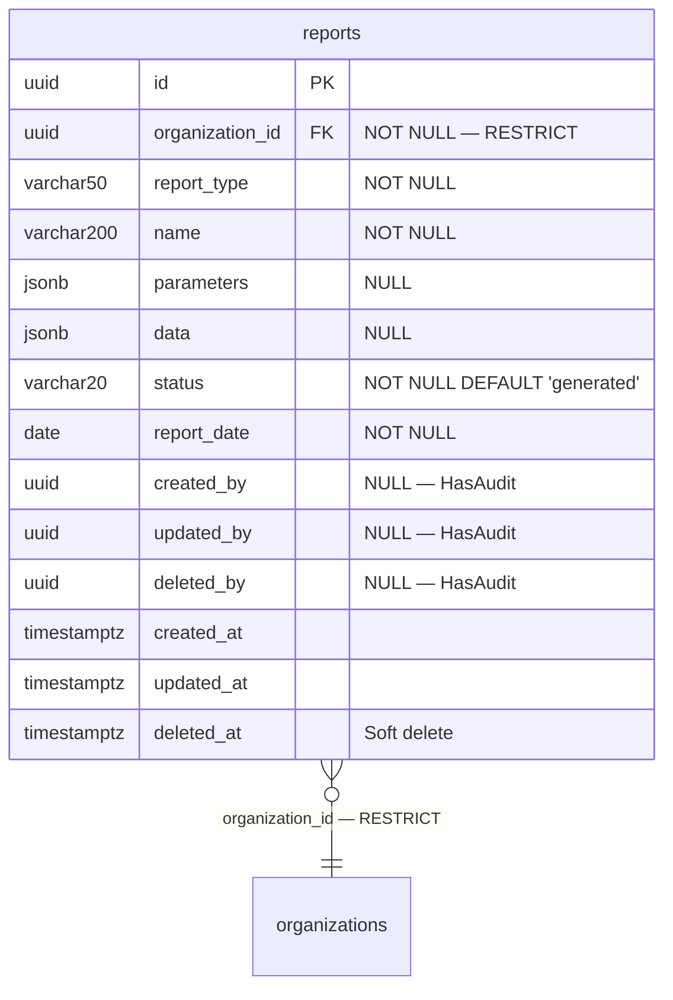

# Phase 25 — Reporting ERD

**Date:** 2026-08-17 | **Phase:** 25 — Reporting | **Status:** STEP_25_04_DRAFT

## 1. Entity — `reports`



## 2. Entity Specification

| # | Column | Type | Nullable | Default | Key | FK |
|---|---|---|---|---|---|---|
| 1 | `id` | `uuid` | NOT NULL | — | PK | — |
| 2 | `organization_id` | `uuid` | NOT NULL | — | — | → organizations.id RESTRICT |
| 3 | `report_type` | `varchar(50)` | NOT NULL | — | — | — |
| 4 | `name` | `varchar(200)` | NOT NULL | — | — | — |
| 5 | `parameters` | `jsonb` | NULL | — | — | — |
| 6 | `data` | `jsonb` | NULL | — | — | — |
| 7 | `status` | `varchar(20)` | NOT NULL | `generated` | — | — |
| 8 | `report_date` | `date` | NOT NULL | — | — | — |
| 9 | `created_by` | `uuid` | NULL | — | — | — |
| 10 | `updated_by` | `uuid` | NULL | — | — | — |
| 11 | `deleted_by` | `uuid` | NULL | — | — | — |
| 12 | `created_at` | `timestamptz` | NOT NULL | CURRENT_TIMESTAMP | — | — |
| 13 | `updated_at` | `timestamptz` | NULL | — | — | — |
| 14 | `deleted_at` | `timestamptz` | NULL | — | — | — |

**14 columns.**

## 3. Relationship Inventory

| # | Child | FK | Parent | Cardinality | ON DELETE | Optional? |
|---|---|---|---|---|---|---|
| 1 | `reports` | `organization_id` | `organizations` | N:1 | RESTRICT | No |

**1 relationship. 0 CASCADE.**

## 4. Constraint & Index Inventory

| Entity | Constraint/Index | Columns | Type |
|---|---|---|---|
| `reports` | PK | `(id)` | PRIMARY KEY |
| `reports` | `reports_org_report_type_idx` | `(organization_id, report_type)` | Composite B-tree |
| `reports` | `reports_report_date_idx` | `(report_date)` | B-tree |

**3 indexes (1 PK + 2 composite/single).**

## 5. Model Guidance

```php
use App\Core\Base\BaseModel;

class Reporting extends BaseModel
{
    protected $table = 'reports';

    protected $casts = [
        'parameters'  => 'array',
        'data'        => 'array',
        'report_date' => 'date',
        'created_at'  => 'datetime',
        'updated_at'  => 'datetime',
        'deleted_at'  => 'datetime',
    ];
}
```

- Extends `BaseModel` (HasUuid, HasAudit, SoftDeletes, $guarded=[])