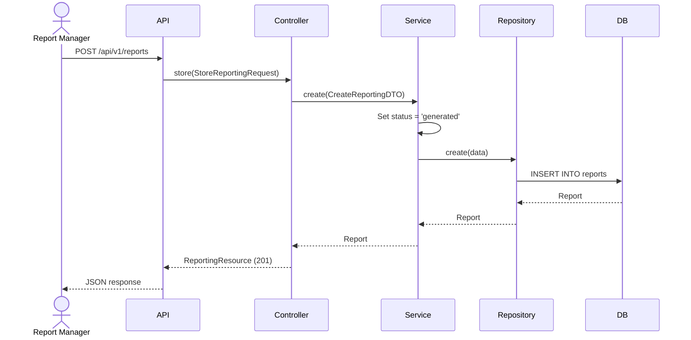
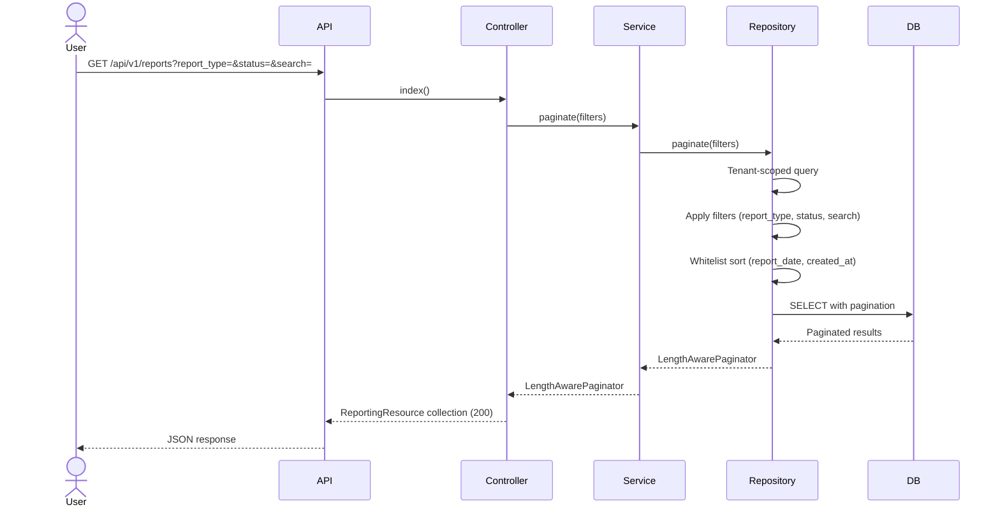
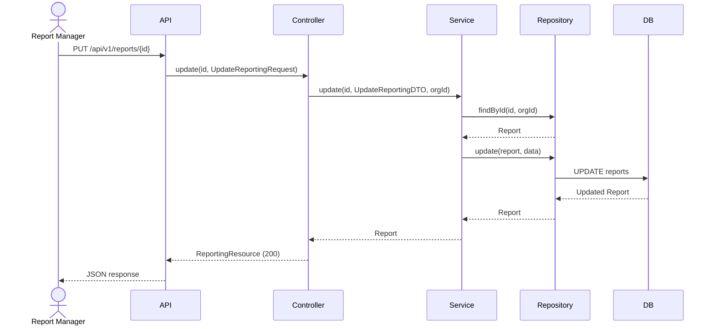
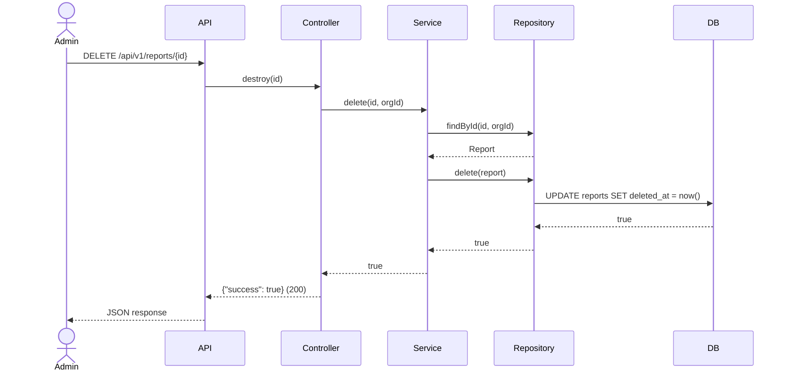

# Phase 25 — Reporting Flow

**Date:** 2026-08-17 | **Phase:** 25 — Reporting | **Status:** STEP_25_03_DRAFT

## Flows

### 1. Create Report

### 2. List Reports

### 3. Update Report

### 4. Delete Report

### Traceability

| Flow | Requirement | Business Rule |
|---|---|---|
| Create | RPT-REQ-001, RPT-REQ-002, RPT-REQ-003, RPT-REQ-004, RPT-REQ-008, RPT-REQ-013 | BR-RPT-001, BR-RPT-002, BR-RPT-003, BR-RPT-004, BR-RPT-005 |
| List | RPT-REQ-009, RPT-REQ-010, RPT-REQ-011, RPT-REQ-012 | BR-RPT-006, BR-RPT-007 |
| Update | RPT-REQ-014 | BR-RPT-013 |
| Delete | RPT-REQ-015 | BR-RPT-008 |