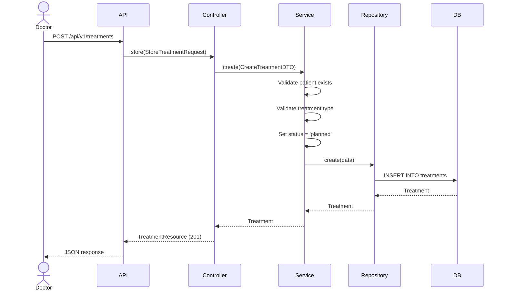
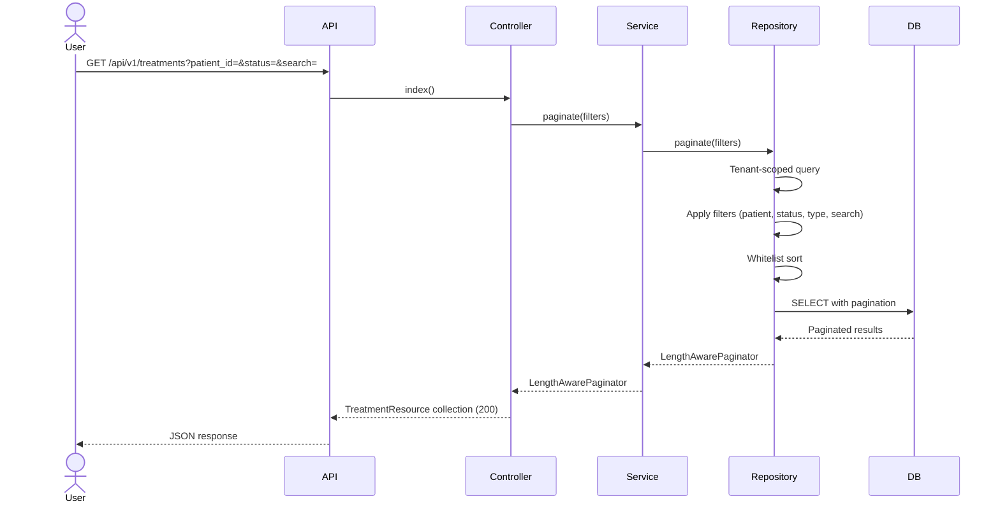
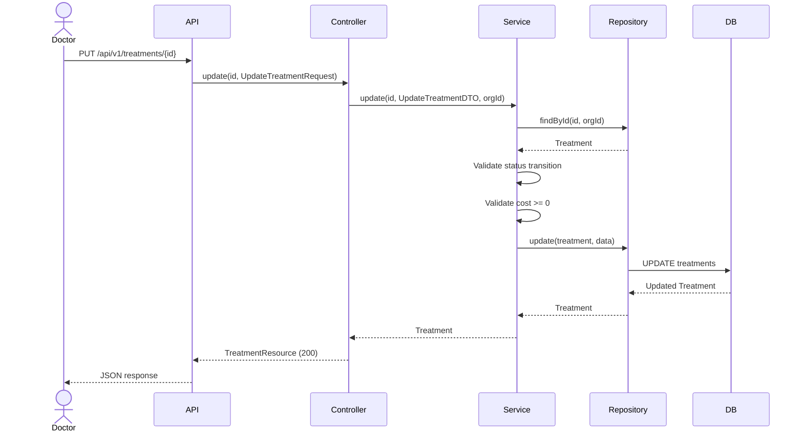
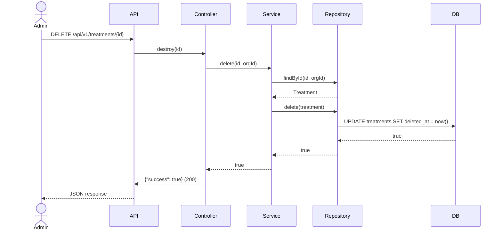
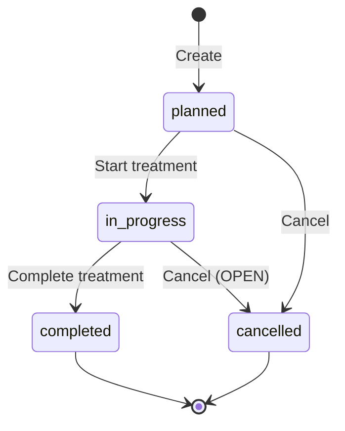

# Phase 16 — Treatment Flow

**Date:** 2026-08-17 | **Phase:** 16 — Treatment | **Status:** STEP_16_03_DRAFT

## Flows

### 1. Create Treatment

### 2. List Treatments

### 3. Update Treatment

### 4. Delete Treatment

### 5. Status Lifecycle Flow

### Traceability

| Flow | Requirement | Business Rule |
|---|---|---|
| Create | TREAT-REQ-001, TREAT-REQ-002, TREAT-REQ-003, TREAT-REQ-006, TREAT-REQ-015 | BR-TREAT-001, BR-TREAT-002, BR-TREAT-006 |
| List | TREAT-REQ-011, TREAT-REQ-012, TREAT-REQ-013, TREAT-REQ-014 | BR-TREAT-014, BR-TREAT-015 |
| Update | TREAT-REQ-016, TREAT-REQ-018 | BR-TREAT-008, BR-TREAT-009, BR-TREAT-010, BR-TREAT-011, BR-TREAT-012 |
| Delete | TREAT-REQ-017, TREAT-REQ-024 | BR-TREAT-016 |
| Status Lifecycle | TREAT-REQ-007, TREAT-REQ-018 | BR-TREAT-007, BR-TREAT-008, BR-TREAT-009, BR-TREAT-010, BR-TREAT-011 |